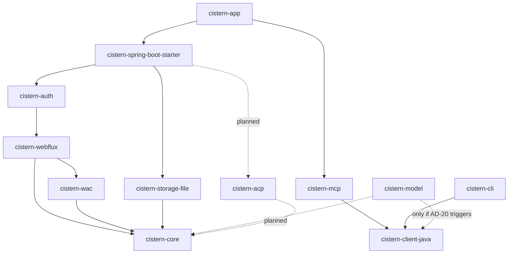
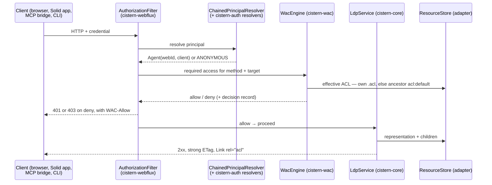
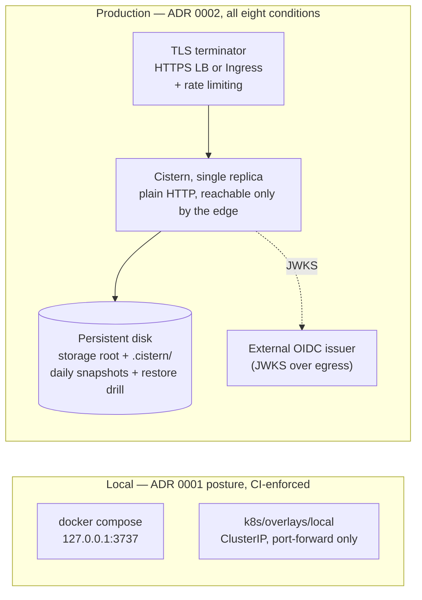

# Cistern architecture

> This document is the *what* — the invariants every module and every ticket is built
> against. `docs/STRATEGY.md` is the *why*: why Cistern is an authority layer for agents
> over user-owned data rather than a Solid server that speaks MCP, and why we are not
> building a framework. `docs/BACKLOG.md` is the *when*; `docs/INTEGRATION.md` is how an
> application drives the server as built.
>
> Decisions carry stable ids (`AD-n`). Cite them in tickets, PRs and reviews; amend a rule
> in place, add the next id for a new one, and never renumber. Each rule states what it
> *prevents*, because that is what makes it checkable — the alternatives weighed and
> rejected stay out of this file so it can be read as decisions only.
>
> This file is canonical. `docs/architecture/` holds the run that produced it — the same
> decisions in spine form, plus the three reviewer passes that caught the AD-15/AD-16
> contradiction and the AD-9 loophole. Amend rules here.

## Design paradigm

**Ports and adapters (hexagonal), with a framework-free domain core.**

`cistern-core` is the hexagon: the resource model, LDP semantics, the RDF layer, and the
two ports it owns. Everything else is an adapter on one side or the other.

| Hexagon role | Module |
| --- | --- |
| Domain core | `cistern-core` |
| Driven port — storage | `ResourceStore` (in core) |
| Driven adapter — storage | `cistern-storage-file`; later object store, r2dbc |
| Driving adapter — HTTP | `cistern-webflux` |
| Driving port — identity | `PrincipalResolver` (in `cistern-webflux`) |
| Driving adapter — identity | `cistern-auth` |
| Policy engine | `cistern-wac`; later `cistern-acp` |
| Out-of-process clients | `cistern-mcp`, `cistern-cli`, later `cistern-client-java` |
| Composition roots | `cistern-spring-boot-starter`, `cistern-app` |

The one non-obvious twist: the identity port points **inward from the HTTP adapter**, not
outward from the core. `cistern-webflux` owns `PrincipalResolver`; `cistern-auth` plugs
into it. How a credential was proved is an HTTP-surface concern, and the core never learns
it.

## The shape

Dotted edges are planned. The diagram is a rule, not a picture — but it governs **domain
dependency**: which module may call whose services and types. Hosting a transport is not a
domain dependency, so `cistern-mcp -> cistern-webflux` (for
`mcp/transport/WebFluxStreamableTransport`, mcp's own server surface) and the clients'
import of `webflux.CisternProperties` are permitted and undrawn. An undrawn *domain* edge is
not (AD-2).

### The request path — one decision point

## Invariants

### Structure

**AD-1 — The domain core takes no framework dependency.** `cistern-core` depends only on
`jena-arq` and `reactor-core`: no Spring import, no HTTP type, no storage-backend type.
`cistern-wac` holds the same bar. Prevents the LDP and RDF semantics becoming un-testable
and un-embeddable, and a second implementation of the same rules growing in the HTTP layer.

**AD-2 — Dependency direction is one-way, and the identity port belongs to the HTTP
adapter.** Edges run only as the diagram draws them. `cistern-auth` depends on
`cistern-webflux`, never the reverse: every credential shape — the owner's local token, a
hashed service principal, an OIDC JWT, a DPoP-bound token — is a resolver plugged into
`ChainedPrincipalResolver` from outside. Adding a credential shape adds a resolver; it
never edits the chain. Prevents two modules each believing they own the credential seam.

**AD-3 — The storage port deals in representations, never in graphs.** `ResourceStore`
moves bytes plus a media type. Backends never parse or serialise RDF; Jena appears only in
core's RDF layer and in `cistern-wac`'s policy reader. Every backend extends
`ResourceStoreContractTest` — the kit is the definition of "a backend", not a courtesy.
Prevents each backend growing its own RDF dialect.

**AD-4 — Backend selection lives only in a composition root.** No domain, HTTP or client
module names a concrete `ResourceStore` in its POM or its imports; only
`cistern-spring-boot-starter` and `cistern-app` select one. *Known violation, owned by
T7.1:* `cistern-webflux` compile-depends on `cistern-storage-file` to default the backend
via `@ConditionalOnMissingBean`. That edge moves to the starter, and no new one is added
meanwhile — otherwise the object-storage backend (#95) arrives as a second hard edge and
neither backend can be excluded from an embed.

### Resource semantics

**AD-5 — The trailing slash is the resource kind.** `/foo/` and `/foo` are distinct
resources per the Solid Protocol. `ResourceIdentifier.isContainer()` is the single
predicate; no module re-derives it from a string. Prevents ad-hoc containerhood tests
disagreeing between the HTTP layer, the store and the policy engine.

**AD-6 — Containment is derived, and server-managed triples are refused.** `ldp:contains`
is computed at read time from `children()` and never stored. A client PUT or PATCH writing
containment triples is refused `409 Conflict` (Solid Protocol §5.3). Prevents a stored
listing drifting into a second, lying source of truth.

**AD-7 — ETags are strong, and preconditions are settled before the store is touched.**
Every write changes the ETag; `lastModified` is monotonic. `If-Match` and `If-None-Match`
are evaluated in the HTTP layer and answered `412` before any store call — a precondition
failure never reaches the backend.

**AD-13 — The storage root's dot-prefixed namespace is server-owned.** `.cistern/` (the
decision log), `.meta.json` sidecars, `.tmp-*` in-flight files and `.self.*` container
records never appear in `children()` or `ldp:contains`. The unit of backup is the whole
storage root **including** `.cistern/` — a restore without the receipts restores the data
but not the account of who touched it. `cistern-wac` owns the decision-record schema:
`DecisionRecord` / `DecisionRecordJson` is the only shape written to the log by any
evaluator, so `JsonLinesDecisionQuery` and `ReceiptsHandler` can read it whole.

### Authority

**AD-8 — Deny by default, and Control implies nothing.** The effective ACL is the
resource's own `.acl`, else the nearest ancestor carrying `acl:default` — where
`acl:default` names **the container**, not the child. No effective ACL granting the mode
means refusal: `403` authenticated, `401` not. `acl:Append` ⊂ `acl:Write`; `acl:Control`
implies no data mode.

**AD-9 — One enforcement point: every front door is an HTTP client of the pod.** A front
door reaches pod data **only** by real HTTP to a running Cistern server, carrying its own
credential — no store handle, no service call, no import of anything below
`cistern-webflux`'s HTTP surface. Every request crosses `AuthorizationFilter`, is decided
by `WacEngine`, and leaves the same receipt, so revoking a grant mid-session takes effect
on the very next call. This holds **in both shapes**: the app-embedded MCP front door runs
in the same JVM as the pod and still issues real HTTP to `cistern.base-url` — sharing a
process is not a licence to short-circuit. Correspondingly, **an MCP connection is one
principal**: one credential, one pod address, fixed for the life of the server. Serving a
second principal means running a second front door.

**AD-14 — The principal carries the client, and only `cistern-acp` may read it.** The
authenticated principal is `Agent(Optional<URI> webId, Optional<URI> client)`, populated
once at authentication and read downstream from the Reactor context. `client` is **inert**
outside a future `cistern-acp`: it may be recorded in decision records and receipts, and it
must not influence an access decision anywhere else. `WacEngine` matches on the WebID
alone. Taken at T4.3 because T4.1's capture from a real IdP settled the question — the
*access* token carries `client_id` (CSS 7.2.0 emits it; `azp` is ID-token only), so the
client is knowable at authentication with no extra round trip.

**AD-15 — A delegation may only narrow: intersection, never union.**
`effective(user, client, resource) = accessFor(user, resource) ∩ accessFor(client, resource)`.
**Absent a delegation policy naming the client, `accessFor(client)` is the unconstrained
set, not the empty one** — the cap binds only where the owner authored a delegation. Read
the identity element as `∅` instead and every request carrying a `client_id` is denied,
which is every service-principal request an application makes. The cost — a second
evaluation per request once a delegation exists — is accepted and designed for.
Sub-delegation is out: depth 1, a delegate may not re-delegate. Excludes the
privilege-escalation class structurally rather than by careful review.

**AD-16 — Delegation is invisible to the harness or it does not ship.** Three conditions,
all three: with no delegation policy present, behaviour is identical to plain WAC; because
delegations only narrow (AD-15), no assertion passing today can begin failing unless a test
deliberately creates a delegation; the feature is config-flagged and **default off** until
the WAC suite is green (T5.5). This is the general rule for extensions of our own —
additive and ignorable: a pod carrying them still passes the harness, and a plain Solid
client still works against it.

### Clients

**AD-10 — One pod-client library for every out-of-process consumer.** ETag and precondition
handling, header names, ACL reading and editing, and the typed `401`/`403`/`412`/`409`
vocabulary live once, in `cistern-client-java` (no Spring). `cistern-mcp` and `cistern-cli`
consume it and hold no private copy. *This is a live divergence:* both today carry their
own `AclEditor`, `AclFetch`, `EntityTagHeader`, `HttpHeaderName`, `RemoteAclDiscovery`,
`WritePrecondition` and `PodStatus`, and the copies have already drifted. The Java and
TypeScript clients cannot share code, so `docs/INTEGRATION.md` §8 is the contract of record
and both are verified against a real server by the same contract tests. T7.9 (#101) is
therefore load-bearing for two shipped modules, not a new-SDK ticket.

**AD-20 — The pod client stands alone, and the shared-model extraction is the evolution
path.** `cistern-client-java` depends on nothing of ours; it declares the handful of value
types it needs against `docs/INTEGRATION.md` §8, so both clients stay mirror images and
neither drags Jena into an application that only speaks HTTP. Chosen because it forecloses
least — a dependency on `cistern-core` is the hardest edge to reverse, since every consumer
inherits it through a public API, whereas extracting shared types later is additive.
*Evolution trigger:* if the client's declared types drift from core's, or a third consumer
appears, extract a framework-free, Jena-free `cistern-model` that both depend on — a new
module and its own ticket, never a quiet refactor.

### Discipline

**AD-11 — One error taxonomy, one mapper, one speaker of HTTP.** Domain code signals a
`CisternException` subtype — a **sealed** hierarchy, so the mapper is checked exhaustively
against it. `ProblemType` **is** the mapping table; `ProblemMapper` only chooses a row.
Only `CisternErrorWebExceptionHandler` speaks HTTP status codes. No `.onErrorResume` for
error mapping in a handler.

**AD-12 — Fully reactive, with the blocking boundary named.** No `.block()`, no
`.toFuture().get()`, no blocking I/O outside `boundedElastic`. Where a transport genuinely
blocks, the boundary is **named**, not incidental. Three are sanctioned and no others:
startup seeding (`PodSeeder`, `OwnerPodSeeder`), the CLI top level (`Session`), and the MCP
stdio session. None is on a request path. A fourth requires amending this rule, not a local
judgement call. `StepVerifier` for core and service tests; `WebTestClient` for HTTP tests.

**AD-17 — The conformance number only moves forward, and only the official lane moves it.**
The CTH runs in CI on every PR; a PR regressing a previously passing assertion is a
blocking failure regardless of what it adds. Only a run against an **unmodified** harness
updates `cth/BASELINE.md`; patched-harness runs are fenced and gate nothing. Current
baseline: **0 passed / 0 failed / 41 untested** (harness 1.2.2, specification-tests 0.0.19)
— the run halts in PREPARE SERVER because the harness client's DPoP proofs carry no `ath`
and RFC 9449 §4.3 requires a resource server to reject exactly that; the fix is upstream in
[conformance-test-harness#789](https://github.com/solid-contrib/conformance-test-harness/pull/789).

**AD-18 — Where two owners share one answer, the proof is end-to-end.** Anything a filter
touches gets a `WebTestClient` test **through the whole chain**, never a slice test alone.
Any property changing security posture gets a binding test. Both rules were paid for: a
`Link rel="acl"` header written by the filter and then replaced by a handler's own `Link`
values, and an `OPTIONS *` answered correctly by a handler the filter rejected before it
could run — both with green handler-level tests. Spring's relaxed binding removes hyphens
rather than converting them (`cistern.auth.service-principals[0].web-id` is
`CISTERN_AUTH_SERVICEPRINCIPALS_0_WEBID`; the intuitive spelling binds nothing, silently),
and `@Value` does not reliably split a comma-separated value into a collection.

**AD-19 — Facing the internet is a checklist the server enforces where it can.** ADR 0002's
eight conditions hold together, not severally: TLS terminated in front; `cistern.owner.web-id`
set — the only enforcement switch, deliberately not a second one; `cistern.owner.token`
unset; one instance per tenant; backups taken **and restored at least once**;
`X-Request-Id` crossing the edge into every receipt; rate limiting at the edge, never
in-process; `cistern.audit.required=true`. The server refuses to start when a credential
source is configured without an owner (`ENFORCEMENT_REQUIRES_OWNER`). Local development
keeps ADR 0001's loopback posture, enforced by CI: `docker-compose.yml` binds `127.0.0.1`,
and `k8s/overlays/local` admits no `NodePort`, `LoadBalancer` or `Ingress`.

## Deployment envelope

Single replica is a consequence, not a preference: the file backend is single-writer, and
its crash safety rests on tmp-then-`ATOMIC_MOVE` on a real filesystem. A bucket mounted
through gcsfuse implements rename as copy-then-delete and voids that **silently** — so the
cloud shape is a VM with a persistent disk, never Cloud Run over a bucket, until the
object-native backend (#95) removes the need for rename entirely.

## Code conventions

| Concern | Convention |
| --- | --- |
| Closed sets | An `enum` — media types, resource kinds, access modes, patch operations, problem types, emitted header names, rejection reasons. Never a bare `String` or `int`. |
| Domain concepts | A `record` or value class enforcing its own rules — `ResourceIdentifier`, `Slug`, `EntityTag`, `Agent`, `RequestId`, `WebIdMapping`. Never a `String`, `Map` or tuple. |
| RDF vocabulary | Per-namespace constant classes in `core.vocab` — `Ldp`, `Solid`, `Acl`, `Foaf`, `Pim`. Never an inline IRI string. |
| Message text | Never inlined at a throw or log site. One catalogue `enum` per module — `CoreMessage`, `AuthMessage`, `WacMessage`, `StorageFileMessage`, `WebfluxMessage`, `McpMessage`, `CliMessage` — each constant carrying a `String.format` template plus `format(Object...)`. |
| Numbers and repeated literals | Named constants. |
| Modules | `cistern-<area>`; package `com.enrichmeai.cistern.<area>`. Java 25, Maven only, no Lombok — records. |
| Fixtures | Captured from a real implementation — a real IdP, real DPoP proofs, real MCP frames. Never invented: a mock built from a guess will confirm the guess. |
| Config | `cistern.*` bound by `@ConfigurationProperties`; security-posture properties carry a binding test (AD-18). |
| Commits | Conventional messages; `git commit -s` (DCO); no AI co-author trailers. One ticket, one branch, one PR; dev agents never self-merge. |
| Writing about specs | Say what a specification **defines** and what Cistern did about what it leaves to the implementer. Never "the spec fails to" or "leaves undefined" — an open point is usually a division of labour, not an oversight. Applies to code comments, error messages clients see, docs, PR text and the site. |

## Stack

| Name | Version |
| --- | --- |
| Java (`maven.compiler.release`) | 25 |
| Spring Boot | 4.1.0 |
| Apache Jena | 6.1.0 |
| nimbus-jose-jwt | 10.9.1 |
| titanium-json-ld | 1.7.0 |
| MCP Java SDK | 2.0.0 |
| picocli | 4.7.7 |
| Conformance harness / specification-tests | 1.2.2 / 0.0.19 |

`pom.xml` is the source of truth; this table mirrors it. Versions were audited against
Maven Central on 2026-07-20 (#58) — milestones and release candidates are never selected.
`junit-jupiter` and `reactor-test` come from the imported `spring-boot-dependencies` BOM.

## Deferred

Not decided here, each with the reason it can wait.

- **AD-9's carve-out for local evaluation — needs an architect's ruling.**
  `cistern-cli/AclReport.java:38` constructs its own `WacEngine` on purpose, so a grant
  report cannot drift from what the server enforces. That reasoning is sound and AD-9 as
  written has no room for it. Either amend AD-9 with a read-only carve-out — a client may
  evaluate locally to *report*, never to decide — or have the report ask the server, since
  `WAC-Allow` on a HEAD already carries effective access. Recorded rather than decided,
  because AD-9 is the rule the whole authority story rests on.
- **Solid-OIDC provider (issuing tokens).** Cistern validates tokens from any IdP and is
  not an IdP. A v2 decision; nothing in v1 depends on the answer.
- **ACP evaluator scheduling.** AD-14, AD-15 and AD-16 fix the rules `cistern-acp` must
  satisfy; *when* it is built is not decided here. Revisit at the Phase 5 exit, when the WAC
  suite result is known. It is a phase in its own right, and estimating it as a fold-in is
  how the Phase 5 estimate gets wrecked.
- **The owner-facing authoring surface for delegations.** Out of v1: a Turtle file is an
  answer for us and not for a pod owner. This is the part that historically kills systems of
  this shape, and v1 leaves it unsolved on purpose rather than by oversight.
- **`cistern-model`, the shared value-type module.** AD-20's evolution path rather than a
  build item: `cistern-client-java` does not exist yet, so extracting a module for its only
  future second consumer would be a refactor in advance of the need.
- **Notifications protocol** (`cistern-notifications`) — after milestone 3.
- **Object-storage and R2DBC backends** (#95) — after the contract kit has proved stable
  against a second implementation. AD-3 and AD-4 are what make the addition cheap.
- **Multi-tenant management beyond ADR 0002 condition 4** — commercial track, separate repo.
  Condition 4 is a business fact before it is a configuration, which is why the server
  cannot check it.
- **Hosted offering tenancy and BYO-IdP** — T7.11 / ADR 0003, unwritten.
- **RDF predicate- or triple-level scoping, purpose limitation, call-count budgets, and
  sub-delegation chains.** Each multiplies both the enforcement surface and the consent
  problem. If chains are ever wanted, adopt macaroons or Biscuit rather than invent a third
  attenuation scheme.

## Ideas parked

- `docs/ideas/privacy-fuzzing.md` — pluggable "controlled distortion" policy at the pod
  boundary, as an open, auditable filter.
- `docs/ideas/agent-scoped-delegation.md` — the reasoning behind AD-14, AD-15 and AD-16.
  Its first two recommendations are now built (the principal shape, and the `client_id`
  capture); what remains open is the ACP evaluator's scheduling, above.
