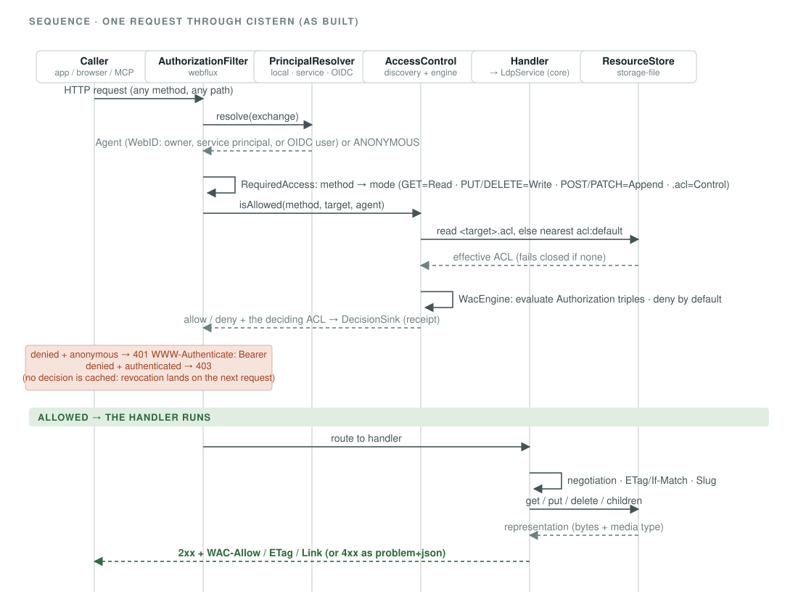
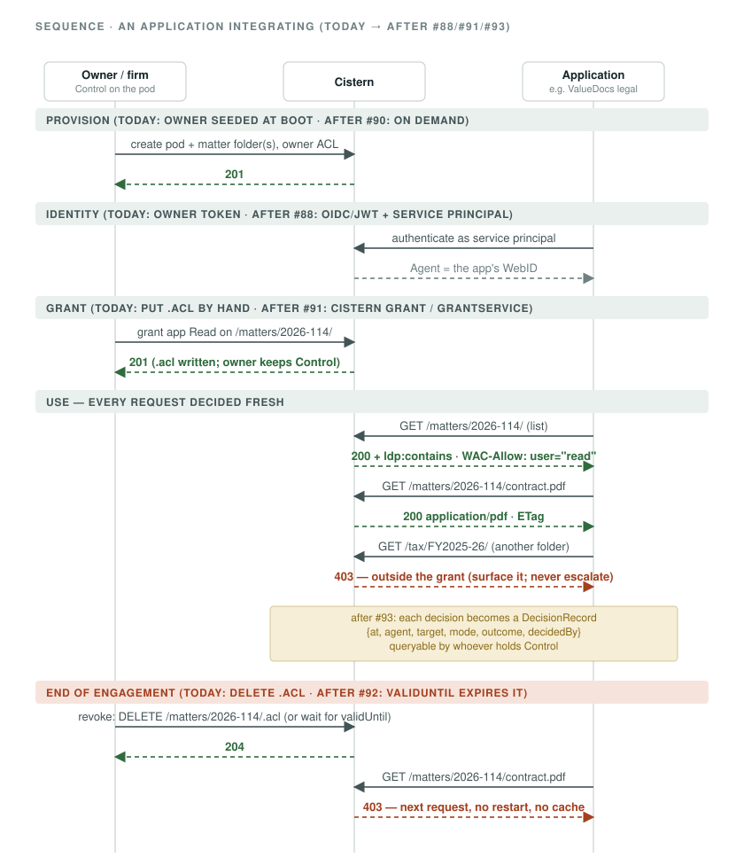
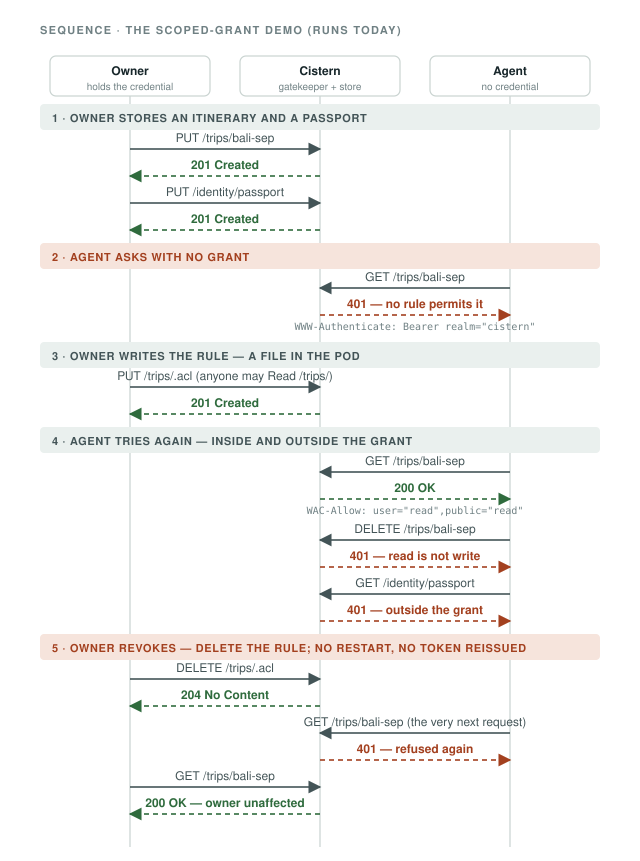

# Cistern — integration architecture and application playbook

Written 2026-08-18. `ARCHITECTURE.md` is the target shape; `BACKLOG.md` is the schedule;
`STRATEGY.md` is the why. This document is for **an application that wants to put its
users' data behind Cistern's authority layer** — first ValueDocs (legal and tax), then anyone.
It describes the server *as it is built today* (verified against a running jar on the date
above), what is planned (with the issue that tracks it), and the exact steps an application
takes. Nothing here is aspirational without a ticket number next to it.

Companion issues: #88 (T4.0 resolver seam), #89 (principal shape decision), #90 (T5.6
provisioning), #91 (T5.7 grant authoring), #92 (T5.8 expiry), #93 (T5.9 receipts), #94 (T7.7
deployment posture), #95 (T1.6 object storage), #96 (this document).

---

## 1. Architecture as built

### 1.1 The request path (verified)

Every HTTP request — from a browser, an application, or (later) the MCP front-end — crosses
the same path. There is no privileged internal route (ARCHITECTURE decision 6).



<details><summary>Text version of the same path</summary>

```
request
  │
  ▼
AuthorizationFilter (WebFilter, cistern-webflux)         ← registered only when cistern.owner.web-id is set
  │  0. X-Request-Id: honoured if well-formed, else minted; echoed on every response
  │  1. PrincipalResolver.resolve(exchange)  → Agent      (ChainedPrincipalResolver: LocalCredential → ServiceCredential → OidcJwt → Anonymous; first authenticated wins)
  │  2. RequiredAccess: method + target → requirements (GET=Read, PUT/DELETE=Write, POST=Append, PATCH=Append, GET ?receipts=Control; any method on <x>.acl = Control on <x>, #112)
  │  3. AccessControl.authorize(requirements, agent) → AccessVerdict   (the only decision point; nothing cached)
  │       AclDiscovery: target's own .acl, else walk up to nearest acl:default   (fails closed)
  │       WacEngine:    evaluate Authorization graphs, deny by default; the decision names the ACL and the rules that granted
  │  4. DecisionSink.record(DecisionRecord)   ← exactly one receipt per decision, allow and deny, BEFORE the response
  │       sink failure: outcome unchanged (default) · fail closed 503 if cistern.audit.required=true
  │  5. denied + anonymous → 401 (WWW-Authenticate: Bearer realm="cistern")
  │     denied + authenticated → 403
  ▼
handler (ResourceRead/Write/Create/Delete/Patch/Options, cistern-webflux)
  │  content negotiation, conditional requests (ETag / If-Match / If-None-Match → 412 / 304), Slug, Link headers
  ▼
LdpService (cistern-core)      containment, RDF io (Jena), N3 Patch, resource kind
  ▼
ResourceStore SPI (cistern-core) ──► cistern-storage-file (file-per-resource + metadata sidecar)
```

</details>

Facts an integrator relies on, all observed on 2026-08-18:

| Behaviour | Observed |
|---|---|
| Non-RDF documents (PDF, DOCX, …) | `PUT` with any `Content-Type` → 201; served back verbatim with the same `Content-Type`; protected like everything else |
| RDF documents | `text/turtle` and `application/ld+json`, negotiated on `Accept`; malformed body → 400 `application/problem+json` |
| Containers | trailing slash is semantic; `GET /trips/` returns `ldp:contains` for children (including the container's `.acl`, today) |
| Create | `PUT` (client names it) → 201; `POST` to a container with `Slug` → 201 + `Location`; replace → 204 |
| Conditional writes | `If-Match` mismatch → 412; `If-None-Match: *` for create-only |
| Discovery | `Link: <…ldp#Resource>; rel="type"`, `Link: <…/.well-known/solid>; rel="…storageDescription"`, `Allow`, `Accept-Put`, `Accept-Patch: text/n3` |
| Authorization state | `WAC-Allow: user="…",public="…"` on GET/HEAD |
| ACL resources | `<x>.acl` takes **Control on `<x>`** for every method (GET/HEAD/OPTIONS/PUT/PATCH/DELETE) — a public or per-agent Read on a container reads its members, never its rule; anonymous 401, authenticated without Control 403 (#112) |
| Correlation | `X-Request-Id` on every response — the client's own if well-formed, else a UUID; the same value is in the receipt (T5.9) |
| Receipts | `GET <resource>?receipts` (Control) → `application/x-ndjson`, one decision per line; `GET /?receipts&agent=<webid>` (Control on the root) for one agent across the pod (T5.9) |
| Errors | RFC 9457 problem details, one mapper (`ProblemType` enum) |

### 1.2 Modules

| Module | State (2026-08-18) | Role |
|---|---|---|
| `cistern-core` | built | resource model, `ResourceStore` SPI, RDF io, containment, N3 Patch, `Agent`, vocab constants (`Acl`, `Foaf`, `Pim`, `Solid`). **No Spring.** |
| `cistern-storage-file` | built | file backend; passes `ResourceStoreContractTest` |
| `cistern-webflux` | built | handlers, negotiation, conditional requests, error mapper, `AuthorizationFilter`, `PrincipalResolver` + `ChainedPrincipalResolver` + `LocalCredentialResolver` + `ServiceCredentialResolver` (`ServicePrincipalRegistry`, `HashedCredential`) + `AnonymousResolver`, `OwnerPodSeeder` + `PodSeeder` (T5.6), `ReceiptsHandler` + `ReceiptsRequest` (T5.9), `CisternProperties` |
| `cistern-wac` | built | `AclDiscovery`, `WacEngine`, `AccessControl`, `Authorization`, `AccessDecision`, `EffectiveAcl`, `RequiredAccess`, `AccessMode`, `AgentClass`, `WacMessage`; **T5.7:** `GrantService`, `GrantRequest`, `RevokeRequest`, `GrantOutcome`, `Grantee`; **T5.6:** `PodProvisioner`, `PodSpec`, `PodProvisioned`; **T5.9:** `AccessVerdict`, `DecisionRecord`, `Outcome`, `RequestId`, `DecisionSink`, `DecisionQuery`, `DecisionLog`, `JsonLinesDecisionSink`, `JsonLinesDecisionQuery`, `DecisionRecordJson`. No Spring. |
| `cistern-auth` | built (T4.0) | `OidcJwtPrincipalResolver`, `JwtVerifier`, `CachingJwksClient`, `WebIdMapping`, `AuthMessage`; Solid-OIDC/DPoP validation (T4.1–T4.4) still to come |
| `cistern-mcp` | **empty** | Phase 6; not needed for an HTTP application |
| `cistern-spring-boot-starter` | scaffold | T7.1 |
| `cistern-app` | built | runnable server; config only |
| `cistern-cli` | built (T5.7, T5.6) | the `cistern` command: `pod create`, `grant`, `revoke` over HTTP with the caller's credential (picocli, shaded jar; `bin/cistern`). |
| Packaging | built | Docker, `docker-compose.yml`, `k8s/`, `infra/terraform` (gated by ADR 0001) |

### 1.3 Built vs planned, for an application

| Need | Today | Planned |
|---|---|---|
| Store documents and metadata per matter | ✅ | — |
| Enforce owner-authored grants per request; scoped read/write; instant revocation | ✅ | — |
| Many human principals (lawyers, clients) | ✅ JWTs from your OIDC issuer (T4.0, #88) | T4.1–T4.4 for Solid-OIDC proper (any IdP, DPoP) |
| Applications as their own principals (legal ≠ tax) | ✅ service principals (T4.0, #88; #89 ruled: apps are their own WebIDs) | (user, client) shape + intersection cap when the MCP front door needs it |
| Create pods/matters on demand | ✅ T5.6 (#90): `cistern.pods.seed[]` at boot, `cistern pod create` over HTTP, `PodProvisioner` for embedders | — |
| Author grants without hand-writing Turtle | ✅ T5.7 (#91): `cistern grant` / `revoke` + `GrantService` | — |
| Grants that expire | ❌ | **#92** T5.8 |
| Receipts (who read what, under which grant) | ✅ T5.9 (#93): every decision recorded with the deciding ACL; `GET ?receipts` for the Control holder | — |
| Internet-facing deployment | ❌ ADR 0001 | **#94** T7.7 after #88 |
| Object storage backend | ❌ file only | **#95** T1.6 |

---

## 2. The integration model

Five sentences that fix the shape of every integration:

1. **The pod is the source of truth.** The application reads from it and writes to it; it
   does not keep an authoritative copy elsewhere (see §5, derived data).
2. **The application is a principal.** It authenticates as *itself* (a service WebID) or
   acts under a human's login; either way it is an `Agent` the WAC engine can name.
3. **A grant is a file the owner controls.** `<container>.acl` (or `<resource>.acl`) with
   `acl:Authorization` triples. The application is *granted*; it never grants itself.
4. **Every request is decided fresh.** No decision outlives the request that produced it, so
   revocation is one request away — and so is expiry once #92 lands.
5. **Every decision leaves a receipt** (#93). Allow and deny alike, with the ACL that granted
   it and the request id you sent: never do anything with pod data you would not want to see
   in the log, because it is in the log.

---

## 2a. Who holds the user's data, and where

Read this before the playbook. It is the first question a CTO, a DPO, or a client's counsel
asks, and the answer is structural, not a setting.

**Cistern is software, not a service.** Whoever runs a Cistern instance holds the data on
that instance. EnrichMeAI holds nothing unless it operates a hosted offering for you (#103 —
not yet offered). There is no phone-home, no telemetry, no copy anywhere else.

| Topology | Who runs the server | Where the bytes are | Who is accountable for the data | Status |
|---|---|---|---|---|
| **Self-hosted by an organisation** (a firm, a business, a public body) | The organisation's own ops, on its own machines or cloud account | Under `cistern.storage.root` on a volume the organisation controls (file backend); an object-storage bucket the organisation owns after #95 | The organisation — it is the data controller/fiduciary; the person is the owner of the pod within it | **Available today** (private network; internet-facing after #94) |
| **Hosted by a provider** (EnrichMeAI or a hosting partner) | The provider | In the provider's region of choice — SG and IN first, per the ADR to be written | Provider as processor; the tenant organisation as controller; the person as pod owner | **Not yet** — #103 decides the model |
| **Personal** (a person runs their own) | The person | Their machine or their cloud account | The person | Available today, developer audience only |

Within any topology:

- **One pod per person (or per client, per firm — your choice), one folder per matter/purpose.** Isolation between pods is enforced by the WAC engine on every request; nothing is reachable through Cistern without a grant. Storage-level isolation between *tenants* (separate roots or buckets per firm) is an ops decision documented in #94.
- **What is stored:** the resources exactly as written (documents byte-for-byte; RDF as parsed graphs), the `.acl` permission files, and metadata sidecars. After #93, an append-only decision log under `<root>/.cistern/decisions/`.
- **What is *not* stored anywhere else:** the application must not keep an authoritative copy (§5, derived-data rule). This is a rule for the integrator, and it is the difference between governance and theatre.
- **In transit:** TLS is terminated in front of Cistern (#94); today the posture is loopback/private network only (ADR 0001).
- **At rest:** the file backend writes plain files. Encryption at rest is the volume's or bucket's (disk/KMS encryption on the host or cloud) — Cistern does not encrypt content itself today. State this in your own DPIA rather than assuming otherwise.
- **Backups and export:** backups are the operator's (schedule + restore drill in #94). Export is inherent — a pod is standard Solid data and can be moved to any conformant server; that portability is part of the pitch and must stay true in any hosted offering (#103).
- **Who can see what:** the pod owner (Control) sees everything in their pod and, after #93, the receipts; a granted application sees only its granted folders; the operator can read the disk — as with any self-hosted system — which is why the operator is the accountable party in the table above.

## 2b. Integration hurdles, and how much work it is

Being straight about the effort is what makes the rest of this document credible.

**How much work, by integrator type**

| Integrator | What they do | Effort today | Effort after the levers land |
|---|---|---|---|
| **An AI assistant** (Claude Desktop, ChatGPT, an in-house agent) | Connects over MCP; the person grants it a folder | Not yet possible — the MCP front door is Phase 6 | **Near zero**: the assistant already speaks MCP; the company integrates nothing |
| **An application** (ValueDocs, a firm's DMS, a consumer app) | Authenticates as a principal, reads/writes under a grant, handles refusal, keeps no authoritative copy | Weeks, and only for a single-owner setup: bearer token, hand-written ACLs, plain HTTP; multi-user needs #88 | Days, once #88 (identity), #91 (grant CLI/API), T7.9 (SDKs) and T7.10 (integration kit) exist; EnrichMeAI does it for the first partners (Shape A) |
| **An operator / hoster** | Runs Cistern for tenants | Local only (ADR 0001); jar/Docker/k8s exist | Production posture after #94; hosted model after #103 |

**The hurdles, named** — each with where it is on the board:

1. **The application has to change how it holds data.** "The pod is the source of truth" is an architecture decision inside the integrator's product, not a library import. No ticket removes this; the derived-data rule (§5) is the contract, and Shape A design-partner engineering is how it is done alongside them the first times.
2. **Identity plumbing.** Their users, their IdP, their service credentials → WebIDs and grants. Today: one owner token. After **#88**: OIDC/JWT resolver + service principals; **T7.10** ships a working Keycloak realm to copy.
3. **Grant authoring.** Today a Turtle file with two silent-deny traps (§9). After **#91**: `cistern grant` / `GrantService`. A consumer-facing authoring UX is a later milestone and the hardest problem in the space.
4. **Provisioning at scale.** Today one owner seeded at boot. After **#90**: pods/matters on demand.
5. **Receipts.** Today the engine names the deciding rule but writes nothing. After **#93**: append-only log + Control-protected query.
6. **Time-limited grants.** Not in WAC. After **#92**: `cistern:validUntil`, fail-closed.
7. **Operations.** Today loopback only. After **#94**: TLS, backups, tenant isolation; **#103** decides hosting.
8. **Client code.** Today: read §8 and write HTTP. After **T7.9**: thin Java/TS clients that make the common mistakes impossible.

**So: is it easy?** For an assistant, it will be trivial once the MCP door exists — that is the strategic point. For an application, it is honest engineering — a few days with the levers above, weeks without them, and a product decision either way about where the data lives. That is why the first integration is our own (ValueDocs) and the next two are done *with* partners rather than handed a document.

## 3. Playbook — integrating an application (ValueDocs as the worked example)

The whole lifecycle in one picture — each band says what is possible today and which ticket
changes it:




Every step says what works **today** and what changes **after** a numbered issue. Commands are
against a local jar; substitute the deployment base URL later.

### Step 0 — Run a Cistern you can hit

> Fastest path: [`integration-kit/`](../integration-kit/README.md) — Cistern + Keycloak (real OIDC issuer) + a seeded pod + a sample app that shows the allow/refuse sequence, in one `docker compose up` (T7.10, #102).

```bash
export CISTERN_OWNER_WEBID='https://acme-law.example/profile#firm'      # the pod owner's WebID
export CISTERN_OWNER_TOKEN="$(openssl rand -hex 32)"                    # today's only credential
export CISTERN_STORAGE_ROOT=/var/lib/cistern
export CISTERN_BASE_URL=http://localhost:3737                           # must match how clients address it
java -jar cistern-app/target/cistern-app-*.jar --server.port=3737
```

Boot seeds `/.acl` granting the owner Read/Write/Append/Control with `acl:accessTo` and
`acl:default`, and nothing to anyone else. Setting the owner is what **turns enforcement on**;
without it the server logs `NO_OWNER_CONFIGURED` at WARN and is unprotected (deliberate, ADR
0001; see #94).

> `docker compose up` does **not** pass the owner variables — export them into compose or use
> the jar/k8s. `kubectl apply -k k8s/` deploys to whatever context is current: check it.

### Step 1 — Identity: who is the application?

**Today (T4.0, #88):** three ways to prove who a request is, all presented as
`Authorization: Bearer <credential>`, all judged by the same engine, tried in this order —
first authenticated wins, else anonymous (`ChainedPrincipalResolver`):

1. **The owner's local token** — `cistern.owner.web-id` + `cistern.owner.token`. One
   principal, the firm; private network only; never shipped to a client device.
2. **A service principal** — the application *as itself*, with its own WebID and its own
   secret. The secret is configured **hashed** (`sha256:<hex>`), so nothing at rest can be
   presented; the application presents the plain secret. Ruled on #89 for v1: applications
   are their own WebIDs, and a grant to one is not a grant to the other.
   ```properties
   cistern.auth.service-principals[0].web-id=https://valuedocs.co.in/apps/legal#id
   cistern.auth.service-principals[0].credential-hash=sha256:af9f6ca9c55937463513e4cb25829d6eaa89ca74ed5699c0690f13469da4c481
   cistern.auth.service-principals[1].web-id=https://valuedocs.co.in/apps/tax#id
   cistern.auth.service-principals[1].credential-hash=sha256:a6944068fa09a27c3d4ed2bf53c1a452c7c8fb1199e4a07549081720504053ec
   ```
   Produce a hash from a shell: `printf '%s' "$SECRET" | shasum -a 256 | cut -d' ' -f1 | sed 's/^/sha256:/'`
   (generate the secret with `openssl rand -hex 32`). Two entries may share a WebID (one
   identity, two credentials, for rotation); two entries may not share a hash (refused at boot).
   As environment: `CISTERN_AUTH_SERVICEPRINCIPALS_0_WEBID`, `CISTERN_AUTH_SERVICEPRINCIPALS_0_CREDENTIALHASH`.
3. **A JWT from your OIDC issuer** — for humans (lawyers, clients) and, if you prefer OAuth
   client credentials to a shared secret, for the applications too. Signature against the
   issuer's published keys (JWKS, discovered from `{issuer}/.well-known/openid-configuration`
   unless `jwks-uri` says otherwise; cached 5 min; refreshed on an unknown `kid`, at most
   every 30 s), then `iss` verbatim, `aud` must contain one of `audiences`, `exp`/`nbf` with
   `clock-skew`. The WebID is either a claim (`webid-claim`, default `webid` — Solid-OIDC's)
   or a template over claims (`webid-template`), never both.
   ```properties
   cistern.auth.oidc.issuer=https://id.valuedocs.co.in/realms/valuedocs   # compared verbatim to iss
   cistern.auth.oidc.audiences=cistern                                    # required; comma-separated
   cistern.auth.oidc.webid-claim=webid                                    # default; or:
   # cistern.auth.oidc.webid-template={iss}/users/{sub}#me                # any string claim in {braces}
   cistern.auth.oidc.clock-skew=60s                                       # default
   # cistern.auth.oidc.jwks-uri=https://…/protocol/openid-connect/certs   # only to bypass discovery
   ```
   Keycloak: add an *Audience* mapper (`Included Custom Audience: cistern`) and, for
   `webid-claim`, a *User Attribute* mapper (`webid` → claim `webid`) to the client; the fixture
   realm in `cistern-auth/src/test/resources/fixtures/keycloak/` is a worked example. A token
   that fails any check authenticates **nobody** — the request proceeds as anonymous and gets
   401 where a grant was needed — and the reason is logged (`Bearer JWT rejected (EXPIRED): …`).

Enforcement is still switched on by `cistern.owner.web-id` (it seeds the root ACL); the
other two are additional ways in, not replacements. There is **no** caching of decisions:
revoking a grant, rotating a service secret or a signing key takes effect on the next request.

**Not yet:** DPoP-bound tokens, `Authorization: DPoP`, WebID dereferencing (T4.1–T4.4); the
(user, client) principal shape and the intersection cap (#89, taken when the MCP front door
needs it).

**After T4.1–T4.4:** any Solid-OIDC identity provider works and DPoP-bound tokens are
accepted — this is what makes "point another firm's tools at the same pod" true.

### Step 2 — Layout: pods, matters, documents

Recommended layout, one pod per firm (or per client, if the client is the owner):

```
/                              pod root  (.acl: owner full, acl:default)
/matters/                      container
/matters/2026-114/             one matter = one container  (.acl written per grant, see step 3)
/matters/2026-114/index        RDF document: matter metadata (title, parties, engagement dates)
/matters/2026-114/contract.pdf non-RDF document
/matters/2026-114/notes/       sub-container, inherits via acl:default unless it has its own .acl
/tax/FY2025-26/                a different container ⇒ a different grant ⇒ separation by default
```

Rules: containers end in `/`; a document never does; `.acl` next to the thing it governs;
put machine-readable metadata in a small RDF document rather than in file names.

Matters and documents are plain `PUT`s (intermediate containers are created for you):

```bash
AUTH="Authorization: Bearer $CISTERN_OWNER_TOKEN"; B=http://localhost:3737
curl -X PUT -H "$AUTH" -H 'Content-Type: text/turtle' \
  --data-raw '<#m> <http://purl.org/dc/terms/title> "Dispute 2026-114" .' $B/matters/2026-114/index      # 201
curl -X PUT -H "$AUTH" -H 'Content-Type: application/pdf' --data-binary @contract.pdf \
  $B/matters/2026-114/contract.pdf                                                                       # 201
```

**Pods** — a container with an owner of its own — are provisioned, not `PUT` (T5.6, #90). A
pod is its root container **plus** an owner ACL (`acl:accessTo` and `acl:default` on the root,
all four modes, nothing to `foaf:Agent`), created together, because a container without an
ACL is unreachable by everyone including its owner. Three ways, one `PodProvisioner`, the same
ACL bytes:

```bash
# 1. At boot, from configuration — N pods, N owners, idempotent on every restart:
export CISTERN_PODS_SEED_0_ROOT=/firms/acme/   CISTERN_PODS_SEED_0_OWNERWEBID='https://acme-law.example/profile#firm'
export CISTERN_PODS_SEED_1_ROOT=/firms/globex/ CISTERN_PODS_SEED_1_OWNERWEBID='https://globex.example/profile#firm'

# 2. On a running server, over HTTP with your credential (you need Write + Control where the root goes):
cistern pod create --root /firms/acme/ --owner 'https://acme-law.example/profile#firm' --base $B
# Created pod /firms/acme/ owned by https://acme-law.example/profile#firm: /firms/acme/.acl grants read, write, append, control on this container and everything inside it.

# 3. Embedded: new PodProvisioner(store).provision(new PodSpec(root, ownerWebId))  →  Created | AlreadyExists
```

Two consequences of "owned by", worth knowing before you script it:

- **A pod is its owner's, not its creator's.** A resource-level ACL replaces inheritance
  (§9 trap 2), so the storage-root owner who seeds `/firms/acme/` for the firm holds nothing
  inside it afterwards — no Read, no Control. That is what makes it the firm's pod and not a
  folder in the operator's. It also means a *second* `cistern pod create` for the same root is
  a no-op (`Already a pod … nothing written`, exit 0) when the **owner** runs it, and a refusal
  (403, exit 2) when the operator does: the server will not even let them read that ACL any
  more. Boot-time seeding has no caller and is idempotent unconditionally.
- **An existing ACL is never overwritten**, by any of the three routes. Provisioning is not a
  request to reset permissions; a container that exists without an ACL is completed, its own
  triples untouched.

A matter provisioned *as a pod for the client* (`--root /firms/acme/matters/2026-114/ --owner
<client>`) is therefore the client's: the firm keeps nothing inside it until the client grants
it back (`cistern grant`). A matter the firm keeps for itself is a plain container under
`/firms/acme/`, reached through the firm's `acl:default`.

### Step 3 — Grant: let the application in, and nothing more

A grant is `PUT <container>.acl` by someone holding **Control** on that container (the
owner does, via `acl:default` from the root). **Today** it is one command (T5.7, #91):

```bash
export CISTERN_TOKEN="$CISTERN_OWNER_TOKEN"                     # or --token; the caller's own credential
bin/cistern grant https://valuedocs.co.in/apps/legal#id --read /matters/2026-114/ --base http://localhost:3737
# Granted: https://valuedocs.co.in/apps/legal#id may now read /matters/2026-114/ and everything inside it.
# /matters/2026-114/.acl now holds:
#   - https://valuedocs.co.in/apps/legal#id: read — this container and everything inside it
#   - https://acme-law.example/profile#firm: read, write, append, control — this container and everything inside it
bin/cistern revoke https://valuedocs.co.in/apps/legal#id /matters/2026-114/                # take it back
```

`cistern grant <webid|public> --read|--write|--append|--control <path>` and
`cistern revoke <webid|public> <path>` (`java -jar cistern-cli/target/cistern-cli-*.jar …`;
`bin/cistern` wraps it). The tool does exactly what an owner editing the file by hand would do
— `GET <target>.acl` (walking up to the nearest ancestor's when there is none, as the engine
does), compute the new ACL, `PUT` it back under `If-Match` (or `If-None-Match: *` when
creating; one automatic re-read and retry on 412) — **with the caller's credential, so the
server enforces Control**. Exit codes: 0 ok · 1 failure · 2 refused (401/403, or a revoke that
would drop Control) · 3 conflict (the ACL kept changing; nothing written). What it writes is the
file below, and it is property-tested never to drop an authorization that grants Control, to
write `acl:accessTo` **and** `acl:default` on a container, and never `acl:default` on a
document. Grants merge (`--read` then `--write` yields one authorization); a revoke removes
only that grantee's authority on that resource. Inherited authorizations *without* Control are
not carried into a new resource-level ACL — the grant is scoped to the container, and the tool
prints what now applies so the narrowing is visible. Applications embedding Cistern call
`GrantService` (cistern-wac, pure) directly and persist the outcome themselves.

The same file, written by hand — the shape the CLI produces for you:

```turtle
@prefix acl:  <http://www.w3.org/ns/auth/acl#> .

<#owner> a acl:Authorization ;
    acl:agent    <https://acme-law.example/profile#firm> ;          # re-state the owner: a resource-level .acl REPLACES inheritance
    acl:accessTo </matters/2026-114/> ; acl:default </matters/2026-114/> ;
    acl:mode     acl:Read, acl:Write, acl:Append, acl:Control .

<#legal-app> a acl:Authorization ;
    acl:agent    <https://valuedocs.co.in/apps/legal#id> ;         # after #88: the app's service WebID (today: only foaf:Agent or the owner exist)
    acl:accessTo </matters/2026-114/> ; acl:default </matters/2026-114/> ;   # BOTH, or children are unreachable
    acl:mode     acl:Read .                                          # read, not write; this container, not the pod
```

Two traps, both of which fail *silently into denial* and both of which the CLI removes:

- **`acl:default` names the container**; omit it and everything inside is unreachable.
- **A resource-level `.acl` replaces inheritance**; omit the owner's authorization and the
  owner is locked out of that subtree (Control from the root no longer applies there).

**After #92:** add `--until 2026-12-31T00:00:00Z`; the engine treats the authorization as
absent after that instant, fail-closed, without a scheduler.

### Step 4 — Read and write from the application

Plain HTTP; no SDK required. Minimum contract:

```bash
APP="Authorization: Bearer <app credential>"     # after #88; today the owner token on a private network
# list a matter
curl -H "$APP" -H 'Accept: text/turtle' $B/matters/2026-114/                # 200 → ldp:contains …
# read a document, keep the ETag
curl -i -H "$APP" $B/matters/2026-114/contract.pdf                          # 200, ETag: "…", WAC-Allow: user="read",public=""
# (if granted Write) replace only if unchanged
curl -X PUT -H "$APP" -H 'If-Match: "<etag>"' -H 'Content-Type: text/turtle' --data-raw '…' $B/matters/2026-114/index   # 204, or 412
# create-only
curl -X PUT -H "$APP" -H 'If-None-Match: *' -H 'Content-Type: text/turtle' --data-raw '…' $B/matters/2026-114/summary
```

Read `WAC-Allow` and show the user what the app may do; do not discover permissions by
trying and catching.

### Step 5 — Handle refusal correctly

| Status | Meaning | Application must |
|---|---|---|
| **401** | no credential, or an invalid one; the resource *may* be reachable if you authenticate | re-authenticate the *same* principal; never escalate to a broader credential |
| **403** | authenticated, and the effective ACL does not grant the required mode | surface "not permitted" to the user with the resource and mode; **do not retry**; do not fall back to a cached copy |
| **412** | your `If-Match`/`If-None-Match` failed | re-read, merge, retry with the new ETag |
| **404** | never used to hide a denial — 401/403 come first | treat as genuinely absent |

Refusal is the product working. Log it on your side with the request id: send your own
`X-Request-Id` (letters, digits, `- _ . ~ : / + =`, up to 128 characters) and the receipt the
owner queries carries the same value; send none and the response's `X-Request-Id` is the
minted one, which the receipt also carries.

### Step 6 — Revoke, and later expire

**Today:** the owner deletes or rewrites the `.acl`; the application's *next* request is
refused (verified: `DELETE /trips/.acl` → next agent `GET` → 401). No restart, no token
reissue, no cache to purge — there is none.
**After #92:** grants carry `cistern:validUntil` and stop working at that instant.

### Step 7 — Receipts (T5.9, #93)

Every decision `AuthorizationFilter` takes — allow and deny, every method — is one
`DecisionRecord {at, agent, target, required, outcome, decidedBy, requestId}`, written before
the response is sent, so a receipts query issued after a response always sees the decision that
produced it. `decidedBy` is the ACL resource whose authorization granted the request; a denial
names none (WAC has no deny rule — nothing decided a refusal, a rule merely failed to grant).

**Ask for them** with `?receipts` on the resource, holding **Control** on it (the owner does;
the application whose access is reported does not — Read on a document must not become a view of
everyone else's traffic to it):

```bash
curl -H "$AUTH" "$B/matters/2026-114/contract.pdf?receipts"                    # 200, application/x-ndjson, one decision per line
curl -H "$AUTH" "$B/matters/2026-114/contract.pdf?receipts&from=2026-08-19T00:00:00Z&to=2026-08-20T00:00:00Z"
curl -H "$AUTH" "$B/?receipts&agent=https%3A%2F%2Fvaluedocs.co.in%2Fapps%2Flegal%23id"  # everything the legal app did, anywhere (Control on the root)
curl -H "$APP"  "$B/matters/2026-114/contract.pdf?receipts"                    # 403: the app reads the document; it does not control it
```

One line per decision, every field present, `null` where absent — observed on 2026-08-19
against the jar after `k8s/demo.sh`:

```
{"at":"2026-08-19T02:05:54.175149Z","agent":null,"target":"http://127.0.0.1:3737/notes/week","required":"READ","outcome":"DENIED_UNAUTHENTICATED","decidedBy":null,"requestId":"244a679e-…"}
{"at":"2026-08-19T02:05:54.200669Z","agent":null,"target":"http://127.0.0.1:3737/notes/week","required":"READ","outcome":"ALLOWED","decidedBy":"http://127.0.0.1:3737/notes/.acl","requestId":"afe30ced-…"}
{"at":"2026-08-19T02:05:54.244018Z","agent":null,"target":"http://127.0.0.1:3737/notes/week","required":"WRITE","outcome":"DENIED_UNAUTHENTICATED","decidedBy":null,"requestId":"6405b7a4-…"}
```

`outcome` is `ALLOWED`, `DENIED_UNAUTHENTICATED` (401 — a scanner or a misconfigured client)
or `DENIED_FORBIDDEN` (403 — a named agent outside its grant, the line the owner wants to see);
`required` is the `AccessMode` the request needed on `target`. The interval is half-open,
`[from, to)`, ISO 8601 instants; both default to the whole log. The query is itself a decision
(Control on the resource) and appears in the log like any other. Records are read back in the
order they were taken.

**Where the log lives.** JSON Lines, one file per UTC day —
`<cistern.storage.root>/.cistern/decisions/YYYY-MM-DD.jsonl` (`cistern.audit.root` moves it) —
written through the storage SPI, but **not pod content**: it is a second store rooted beside the
pod's, in its own `cistern-audit:` URI space, never listed by a container, not addressable by any
HTTP path (`GET /.cistern/…` is a 404 to the owner), readable only through `?receipts`, which
returns decisions and never bytes. The append is read-modify-write of the day file (the SPI has
no append), serialized in-process so overlapping requests cannot drop each other's lines; the
response waits for it — one asynchronous store write, never a blocked event loop.

**If the log cannot be written.** `AuditPolicy` (cistern-wac) is the closed set of two answers,
applied around the sink at wiring. `BEST_EFFORT`, the default: the decision stands and the
failure is logged at WARN with the request id (`DECISION_NOT_RECORDED_OUTCOME_STANDS`).
`REQUIRED` (`cistern.audit.required=true`): a decision that cannot be recorded is not acted on
— the request fails closed with **503** through the one error mapper
(`type: …/problems/service-unavailable`) — retry later, unlike a 403.

Design your application so that "which app read which document, under which permission, when"
is a report you would be happy to hand the client — because it is one, and the owner can run it.

### Step 8 — Deploy

**Today:** private network only (ADR 0001): loopback jar, `docker-compose` bound to
`127.0.0.1`, or the k8s manifests with a `ClusterIP` service and `port-forward`.
**After #88 → #94:** TLS + domain, GCP via `infra/terraform` (COS + persistent disk; never
Cloud Run + gcsfuse), backups with a restore drill, per-firm isolation, edge rate limiting.

### Step 9 — Test your integration




Run `k8s/demo.sh` against your instance (`CISTERN_BASE`, `CISTERN_TOKEN`) — it exercises
create, deny-by-default, grant, scoped read vs write vs outside-grant, revoke, owner-unaffected.
Then run the same sequence with your application's credential (after #88). Treat every
status in the table above as a contract; open an issue if any differ.

---

## 4. What Cistern will not do for you (by design)

- **Search or indexing.** The pod is storage plus authority. Build indexes in the application
  — under the rule in §5.
- **Issue identities.** Cistern validates logins; bring an OIDC issuer (yours, Singpass-style,
  or any Solid-OIDC IdP after T4.x).
- **Author grants for the owner.** The owner (or someone holding Control) grants; the
  application asks. Do not ship a flow in which the application writes its own `.acl`.

---

## 5. The derived-data rule for applications

Governance is theatre if the application keeps a permanent copy of what it read. Rule:

- **Ephemeral processing is fine** — read under the grant, compute (summaries, embeddings,
  answers), return to the user.
- **Persistent derived data goes back into the pod**, under the same grant, next to its source
  (`/matters/2026-114/derived/embeddings` — the app needs `Append`/`Write` on that
  sub-container, which the owner grants explicitly), or is not kept.
- **Never** copy pod content into an application database keyed by the client, and never
  train on it. If a cache is unavoidable, key it by ETag, expire it aggressively, and treat a
  403 as an instruction to purge.

This is a ValueDocs design decision, not Cistern code — and it is the first thing a
diligent buyer or partner will probe.

---

## 6. First-cut interfaces and modules

Consolidated from #88–#95 so the shape is visible in one place. Names follow the existing
types (`Agent`, `PrincipalResolver`, `AccessControl`, `AccessDecision`, `Authorization`,
`ResourceStore`); ground rule 7 applies (records, enums, sealed interfaces, one message
catalogue per module; no Spring in `cistern-core`/`cistern-wac`).

```
                 ┌──────────────────────────── cistern-webflux ─────────────────────────────┐
  HTTP ─────────►│ AuthorizationFilter ── ChainedPrincipalResolver ── RequiredAccess          │
                 │        │                    ├─ LocalCredentialResolver (exists)             │
                 │        │                    ├─ ServiceCredentialResolver   (#88, uses ↓)    │
                 │        │                    └─ OidcJwtPrincipalResolver    (#88, cistern-auth)
                 │        ▼                                                                    │
                 │   AccessControl.authorize ──► DecisionSink.record   (built, #93)            │
                 │   ReceiptsHandler ◄── DecisionQuery                  (built, #93)            │
                 └───────┬──────────────────────────────────────────────────────────────────────┘
                         ▼
   ┌───────────── cistern-wac (no Spring) ─────────────┐   ┌──────── cistern-auth ────────┐
   │ AclDiscovery · WacEngine · Authorization(+validUntil #92) │   │ OidcIssuer · JwksClient       │
   │ AccessDecision(decidedBy, authorizations) · EffectiveAcl │   │ WebIdMapping · AuthMessage    │
   │ GrantService (#91) · PodProvisioner (#90)            │   │ ServicePrincipalRegistry (#88)│
   │ AccessVerdict · DecisionRecord · DecisionSink ·       │   └───────────────────────────────┘
   │ DecisionQuery · DecisionLog · JsonLines* (built, #93) │
   └───────────────────────┬────────────────────────────┘
                           ▼
   ┌── cistern-core (no Spring) ──┐   ┌── cistern-storage-file ──┐  ┌── cistern-storage-gcs (#95) ──┐
   │ Agent(+client? #89) · vocab   │   │ ResourceStore impl        │  │ ResourceStore impl             │
   │ Cistern vocab (#92) · SPI     │   └───────────────────────────┘  └────────────────────────────────┘
   └───────────────────────────────┘
   ┌── cistern-cli (new, #90/#91) ──┐   ┌── cistern-mcp (Phase 6) ──┐
   │ cistern pod create · grant ·    │   │ MCP front-end; same filter │
   │ revoke                          │   └────────────────────────────┘
   └─────────────────────────────────┘
```

Dependency rule, unchanged: `webflux → wac → core`; `auth → webflux` (it implements a
webflux interface) and `auth → core`; storage backends `→ core` only; `cli → wac, core`
(talks HTTP to a server for grant/pod operations with the caller's credential, so the server
enforces Control — decided in #91; `GrantService` stays pure so an application can embed it).

### 6.1 Identity (#88, #89)

Built in T4.0 (#88); the shapes below are the first cut and the code is authoritative where
they differ (`ChainedPrincipalResolver.Member` is how another module joins the chain;
`JwksClient` is `keys()`/`refresh()`; `ServicePrincipalRegistry` and `ServiceCredentialResolver`
live in cistern-webflux; `HashedCredential` is `sha256:<hex>`; `JwtVerifier` returns a sealed
`JwtVerdict` with a typed `JwtRejectionReason`).

```java
// exists — cistern-core
public record Agent(Optional<URI> webId) { static Agent ANONYMOUS; static Agent of(URI); boolean isAuthenticated(); }
// #89 candidate: public record Agent(Optional<URI> webId, Optional<URI> client) — decision, not implementation

// exists — cistern-webflux.auth
public interface PrincipalResolver { Mono<Agent> resolve(ServerWebExchange exchange); }

// #88 — cistern-webflux.auth
public final class ChainedPrincipalResolver implements PrincipalResolver {
    public ChainedPrincipalResolver(List<PrincipalResolver> ordered) {…}     // first authenticated Agent wins; else ANONYMOUS
}
public final class ServiceCredentialResolver implements PrincipalResolver {
    public ServiceCredentialResolver(ServicePrincipalRegistry registry) {…}
}

// #88 — cistern-auth
public final class OidcJwtPrincipalResolver implements PrincipalResolver {
    public OidcJwtPrincipalResolver(OidcIssuer issuer, WebIdMapping mapping, JwksClient jwks, Clock clock) {…}
}
public record OidcIssuer(URI issuer, Set<String> audiences, Duration clockSkew) {}
public sealed interface WebIdMapping permits WebIdMapping.Claim, WebIdMapping.Template {
    record Claim(String claimName) implements WebIdMapping {}                 // e.g. "webid"
    record Template(String template) implements WebIdMapping {}               // e.g. "{iss}/users/{sub}#me"
}
public interface JwksClient { Mono<JWKSet> keys(URI issuer); }                // Nimbus; cached; refreshed on unknown kid
public record ServicePrincipal(URI webId, HashedCredential credential) {}
public interface ServicePrincipalRegistry { Optional<ServicePrincipal> byCredential(String presented); Set<URI> webIds(); }
public enum AuthMessage { ISSUER_UNREACHABLE("…%s…"), TOKEN_REJECTED("…"), …; public String format(Object... args) }
```

Config (`CisternProperties`, new nested records):

```
cistern.auth.oidc.issuer=https://id.valuedocs.co.in
cistern.auth.oidc.audiences=cistern
cistern.auth.oidc.webid-claim=webid          # or webid-template
cistern.auth.service-principals[0].web-id=https://valuedocs.co.in/apps/legal#id
cistern.auth.service-principals[0].credential-hash=…
```

### 6.2 Provisioning (#90 built)

```java
// cistern-wac (no Spring; I/O only through ResourceStore)
public final class PodProvisioner {
    public PodProvisioner(ResourceStore store) {}
    public Mono<PodProvisioned> provision(PodSpec spec);        // container if absent + owner ACL; never over an existing ACL
    public static Model ownerAclGraph(PodSpec spec);           // the ACL shape: <acl>#owner, accessTo + default, all modes
    public static Representation ownerAcl(PodSpec spec);       // …serialized as Turtle — what is stored
}
public record PodSpec(ResourceIdentifier root, URI ownerWebId) { ResourceIdentifier acl(); }   // root must be a container; owner absolute
public sealed interface PodProvisioned permits PodProvisioned.Created, PodProvisioned.AlreadyExists {
    ResourceIdentifier root();
    record Created(ResourceIdentifier root, ResourceIdentifier acl) implements PodProvisioned {}
    record AlreadyExists(ResourceIdentifier root) implements PodProvisioned {}
}
// cistern-webflux: OwnerPodSeeder (cistern.owner → the storage root) and PodSeeder (cistern.pods.seed[n]) are
// ApplicationRunners over one PodProvisioner bean; CisternProperties.Pods/Seed validate at bind time.
// cistern-cli: RemotePodProvisioner runs the same sequence over HTTP (GET <root>.acl; If-None-Match: * on both PUTs).
```

### 6.3 Grants and expiry (#91 built, #92)

```java
// cistern-wac — built (T5.7). Pure: no I/O; the caller persists the outcome (the CLI over HTTP,
// an embedding application against its ResourceStore). Input is the effective ACL as AclDiscovery
// finds it — the target's own, or an ancestor's under AclScope.INHERITED.
public final class GrantService {
    public GrantOutcome grant(EffectiveAcl current, GrantRequest request);
    public GrantOutcome revoke(EffectiveAcl current, RevokeRequest request);   // Conflict if it would drop Control
}
public record GrantRequest(ResourceIdentifier target, Grantee grantee, Set<AccessMode> modes) {}   // closed under implication; validUntil is #92
public record RevokeRequest(ResourceIdentifier target, Grantee grantee) {}
public sealed interface Grantee permits Grantee.WebId, Grantee.Public {
    record WebId(URI webId) implements Grantee {}
    record Public() implements Grantee {}                                     // acl:agentClass foaf:Agent; Grantee.PUBLIC
}
public record GrantOutcome(ResourceIdentifier aclResource, Set<Authorization> authorizations, Model aclGraph, boolean changed) {}

// #92 — cistern-core vocab
public final class Cistern { public static final String NS = "https://enrichmeai.com/ns/cistern#"; public static final Property VALID_UNTIL = …; }
// #92 — cistern-wac
public record Authorization(…, Optional<Instant> validUntil) { public boolean isActive(Instant now) {…} }
```

Invariant (tested): after any sequence of `grant`/`revoke`, the owner still holds Control on
the target; container grants always carry `accessTo` and `default`.

### 6.4 Receipts (#93, built — T5.9)

```java
// cistern-wac — the decision carries its policy
public record AccessDecision(Set<AccessMode> modes, Optional<ResourceIdentifier> decidedBy, Set<URI> authorizations) {
    static final AccessDecision DENIED;                       // no modes ⇒ no decidedBy, no authorizations (enforced)
    static AccessDecision of(Set<AccessMode>, ResourceIdentifier decidedBy, Set<URI> authorizations);
}
public record Authorization(Optional<URI> subject, Set<AccessMode> modes, Set<URI> agents, Set<AgentClass> agentClasses, Set<URI> targets) {}
public record AccessVerdict(List<Judgement> judgements) {    // one per AccessRequirement, in RequiredAccess order
    record Judgement(AccessRequirement requirement, AccessDecision decision) { boolean satisfied(); }
    boolean allowed(); Judgement primary(); Optional<ResourceIdentifier> decidedBy();   // decidedBy: empty on any denial
}
public final class AccessControl { Mono<AccessVerdict> authorize(List<AccessRequirement>, Agent); Mono<Boolean> isAllowed(String, ResourceIdentifier, Agent); … }
public final class RequiredAccess { static List<AccessRequirement> forRequest(String method, ResourceIdentifier target);
                                    static List<AccessRequirement> forReceipts(ResourceIdentifier target); }   // Control

// cistern-wac — the receipt
public record DecisionRecord(Instant at, Agent agent, ResourceIdentifier target, AccessMode required,
                             Outcome outcome, Optional<ResourceIdentifier> decidedBy, RequestId requestId) {
    static DecisionRecord of(Instant at, Agent agent, AccessVerdict verdict, RequestId requestId);
}
public enum Outcome { ALLOWED, DENIED_UNAUTHENTICATED, DENIED_FORBIDDEN }
public record RequestId(String value) { static Optional<RequestId> parse(String); static RequestId generate(); }   // [A-Za-z0-9._~:/+=-]{1,128}
public interface DecisionSink  { Mono<Void> record(DecisionRecord record); }                       // completes when durable
public interface DecisionQuery { Flux<DecisionRecord> forResource(ResourceIdentifier target, Instant from, Instant to);
                                 Flux<DecisionRecord> forAgent(URI webId, Instant from, Instant to); }   // [from, to)
public record DecisionLog(ResourceStore store, ResourceIdentifier root) {   // cistern-audit:///decisions/YYYY-MM-DD.jsonl
    static DecisionLog in(ResourceStore store); ResourceIdentifier fileFor(Instant at); …
}
public final class JsonLinesDecisionSink implements DecisionSink, AutoCloseable   // read-modify-write append, single in-process drain
public final class JsonLinesDecisionQuery implements DecisionQuery                // day-pruned scan, line order
public enum DecisionField { AT, AGENT, TARGET, REQUIRED, OUTCOME, DECIDED_BY, REQUEST_ID }   // the JSON member names
public final class DecisionRecordJson { static String toLine(DecisionRecord); static Optional<DecisionRecord> parse(String line); }
// test-jar: InMemoryDecisionSink implements DecisionSink, DecisionQuery

// cistern-core
public static final class CisternException.ServiceUnavailable   // → 503, ProblemType.SERVICE_UNAVAILABLE

// cistern-webflux
public enum AuditPolicy { BEST_EFFORT, REQUIRED; static AuditPolicy of(boolean required); DecisionSink guard(DecisionSink delegate); }   // cistern-wac
AuthorizationFilter(PrincipalResolver, AccessControl, RequestPaths, DecisionSink guardedByPolicy, Clock)   // cistern-webflux
public final class ReceiptsHandler { Mono<ServerResponse> receipts(ServerRequest); }   // GET ?receipts, application/x-ndjson, Cache-Control: no-store
record ReceiptsRequest(Instant from, Instant to, Optional<URI> agent) { static boolean isRequested(MultiValueMap<String,String>); static ReceiptsRequest parse(…); }
enum ReceiptsParameter { RECEIPTS("receipts"), FROM("from"), TO("to"), AGENT("agent") }
// beans: DecisionLog (FileResourceStore at cistern.audit.root, default <storage root>/.cistern) · DecisionSink · DecisionQuery — all @ConditionalOnMissingBean;
//        the receipts route is registered under the same condition as the filter (cistern.owner.web-id) and never bypasses it
// config: cistern.audit.required=false (true ⇒ an unrecordable decision fails closed, 503) · cistern.audit.root
```

Decisions taken here, for the record: a **denial names no policy** (`decidedBy` empty on every
`DENIED_*`, even when the effective ACL granted some *other* mode) — WAC has no deny rule, so
there is nothing to blame a refusal on; the receipt describes the **request target** and the mode
required there (a `DELETE` refused on its *parent's* Write is still recorded against the
resource, `required=WRITE`); the response **waits** for the append, so "if you got an answer
there is a receipt" holds without a race; **NDJSON** rather than a JSON array because it is the
log's own format and streams; the log is a **second store outside the pod's URI space** rather
than an excluded subtree of the pod's, so no storage-layer code had to learn what an audit log
is and no HTTP path can reach it.

### 6.5 Storage (#95)

```java
// exists — cistern-core
public interface ResourceStore { Mono<StoredResource> get(ResourceIdentifier); Mono<StoredResource> put(ResourceIdentifier, Representation);
                                 Mono<Void> delete(ResourceIdentifier); Flux<ResourceIdentifier> children(ResourceIdentifier); Mono<Boolean> exists(ResourceIdentifier); }
// #95 — cistern-storage-gcs: same interface, object metadata carries media type + ETag; must pass ResourceStoreContractTest
```

### 6.6 CLI (#90 built, #91 built)

```
cistern pod create   --root </firms/acme/> --owner <webid>                     [--base <url>] [--token <cred>]   built
cistern grant        <webid|public> --read|--write|--append|--control <path>   [--base <url>] [--token <cred>]   built
cistern revoke       <webid|public> <path>                                     [--base <url>] [--token <cred>]   built
cistern receipts     <path> [--from … --to …]                            not built — GET <path>?receipts is the surface today (#93)
```

`pod create` is `GET <root>.acl` (200 → already a pod, nothing written), then `PUT <root>/`
and `PUT <root>.acl` both under `If-None-Match: *`; the server enforces Write and Control at
the root. Exit 0 created or already there (as the owner); 2 refused; 3 conflict.

`--until <ISO-8601>` on `grant` arrives with #92. `cistern-cli` is a shaded executable jar
(`cistern-cli/target/cistern-cli-<version>.jar`, picocli); `bin/cistern` wraps it; `--token`
defaults to `CISTERN_TOKEN`; `--base` to `http://127.0.0.1:3737`.

---

## 7. Configuration reference (today)

| Property | Env | Default | Meaning |
|---|---|---|---|
| `server.port` | — | 3000 | HTTP port (compose/k8s map 3737 → 3000) |
| `cistern.base-url` | `CISTERN_BASE_URL` | `http://localhost:3000` | the origin resources are minted under; must match how clients address the server |
| `cistern.storage.root` | `CISTERN_STORAGE_ROOT` | `./data` | file backend root |
| `cistern.owner.web-id` | `CISTERN_OWNER_WEBID` | unset | pod owner; **setting it turns enforcement on** and seeds `/.acl` |
| `cistern.owner.token` | `CISTERN_OWNER_TOKEN` | unset | the owner's bearer secret (private network only) |
| `cistern.cors.allowed-origins` / `.max-age` | — | `*` / — | CORS (T2.8) |
| `cistern.auth.service-principals[n].web-id` / `.credential-hash` | `CISTERN_AUTH_SERVICEPRINCIPALS_n_WEBID` / `_CREDENTIALHASH` | unset | an application as its own principal; hash is `sha256:<hex>` (T4.0) |
| `cistern.auth.oidc.issuer` | `CISTERN_AUTH_OIDC_ISSUER` | unset | trusted OIDC issuer, compared verbatim to `iss`; **setting it enables the JWT resolver** (T4.0) |
| `cistern.auth.oidc.audiences` | `CISTERN_AUTH_OIDC_AUDIENCES` | — (required with issuer) | `aud` must contain one of these |
| `cistern.auth.oidc.webid-claim` / `.webid-template` | … | `webid` / — | how a token names a WebID; one or the other |
| `cistern.auth.oidc.clock-skew` | … | `60s` | tolerance on `exp`/`nbf` |
| `cistern.auth.oidc.jwks-uri` | … | discovered | where the keys are, if not via `.well-known/openid-configuration` |
| `cistern.pods.seed[n].root` / `.owner-web-id` | `CISTERN_PODS_SEED_n_ROOT` / `_OWNERWEBID` | unset | a pod to provision at boot: root as a container path under the base URL (`/firms/acme/`), owner as an absolute WebID; idempotent, never overwrites; refused at bind time if the root is not a container path, is listed twice, or is `/` with an owner other than `cistern.owner.web-id` (T5.6) |

| `cistern.audit.required` | `CISTERN_AUDIT_REQUIRED` | `false` | `true` ⇒ a decision the log cannot record is not acted on: 503, retry later (T5.9) |
| `cistern.audit.root` | `CISTERN_AUDIT_ROOT` | `<cistern.storage.root>/.cistern` | directory of the JSON Lines decision log (`decisions/YYYY-MM-DD.jsonl`); not pod content wherever it is (T5.9) |

Planned: `cistern.storage.backend` (#95).

---

## 8. Status-code contract (observed 2026-08-18)

| Request | Result |
|---|---|
| anonymous `GET`/`PUT`/`DELETE` on a protected resource | **401** + `WWW-Authenticate: Bearer realm="cistern"` |
| authenticated, effective ACL grants nothing / not the required mode | **403** |
| owner `PUT` new document (any media type) | **201** |
| owner `PUT` replace | **204** |
| `POST` to container with `Slug` | **201** + `Location` |
| `PUT` with failing `If-Match` | **412** |
| malformed RDF body | **400** `application/problem+json` (`type: …/problems/bad-input`) |
| `DELETE` non-empty container | **409** |
| `DELETE` a resource without Write on its **parent** container as well | **403** (removing a child edits the parent's containment) |
| any method on an `.acl` resource (`GET`/`HEAD`/`OPTIONS`/`PUT`/`PATCH`/`DELETE`) without **Control on the resource it governs** | anonymous **401** / authenticated **403** — Read or Write on the resource is not enough (#112) |
| `OPTIONS` | **204** + `Allow`, `Accept-Put`, `Accept-Patch` |
| `GET` with a grant | **200** + `WAC-Allow: user="read",public="…"` |
| `GET ?receipts` holding Control | **200** `application/x-ndjson`, `Cache-Control: no-store`; without Control **401**/**403** as above; malformed `from`/`to`/`agent` **400** |
| any request, `cistern.audit.required=true`, decision log unwritable | **503** `application/problem+json` (`type: …/problems/service-unavailable`); nothing was served or written |
| every response through the filter | `X-Request-Id: <yours if well-formed, else a UUID>` |

---

## 9. ACL template and the two traps (what `cistern grant` writes for you)

```turtle
@prefix acl:  <http://www.w3.org/ns/auth/acl#> .
@prefix foaf: <http://xmlns.com/foaf/0.1/> .

<#owner> a acl:Authorization ;
    acl:agent    <OWNER-WEBID> ;
    acl:accessTo <CONTAINER/> ; acl:default <CONTAINER/> ;
    acl:mode     acl:Read, acl:Write, acl:Append, acl:Control .

<#grantee> a acl:Authorization ;
    acl:agent    <GRANTEE-WEBID> ;              # or  acl:agentClass foaf:Agent  for "anyone"
    acl:accessTo <CONTAINER/> ; acl:default <CONTAINER/> ;
    acl:mode     acl:Read .
```

1. `acl:default` **names the container** and is required for children to inherit.
2. A resource-level `.acl` **replaces** inheritance — always re-state the owner.

`Append ⊂ Write`; `Control` implies nothing else; `DELETE` needs Write on the resource **and**
its parent. Anonymous → 401, authenticated-and-denied → 403.
