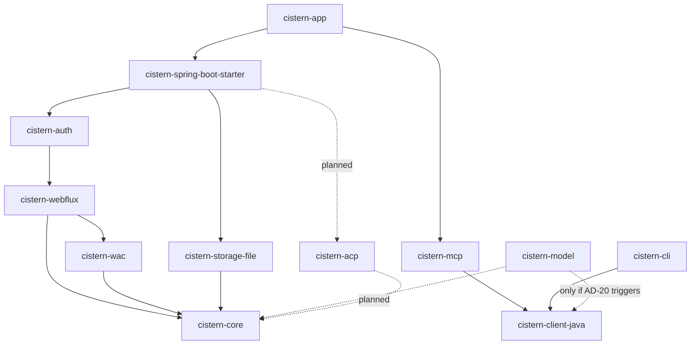
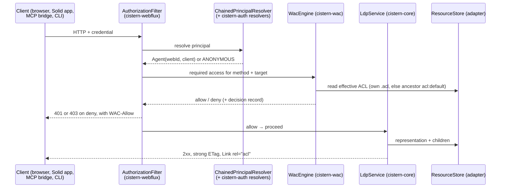
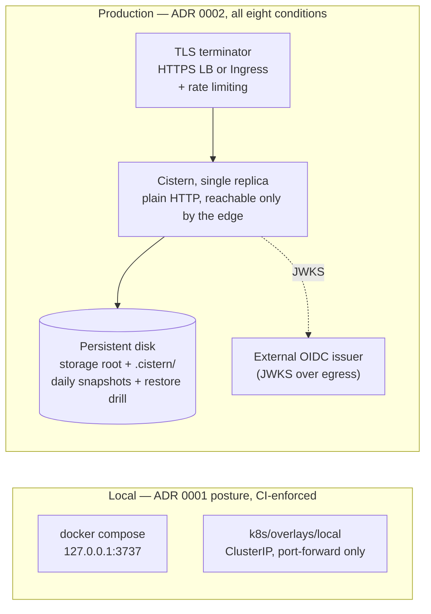

# Architecture Spine — Cistern

> **`docs/ARCHITECTURE.md` is canonical.** This file is the record of the run that
> produced it on 2026-09-04 — the same twenty decisions, in the spine's own structure,
> alongside the three reviewer passes in `reviews/`. When the two disagree, the canonical
> doc wins and this one is stale. Amend `AD` rules there; re-run the architecture skill to
> regenerate this.

## Design Paradigm

**Ports and adapters (hexagonal), with a Spring-free domain core.**

`cistern-core` is the hexagon: the resource model, the LDP semantics, the RDF layer, and
the two ports it owns. Everything else is an adapter on one side or the other.

| Hexagon role | Module | Namespace |
| --- | --- | --- |
| Domain core | `cistern-core` | `com.enrichmeai.cistern.core` |
| Driven port — storage | `ResourceStore` (in core) | `core` |
| Driven adapter — storage | `cistern-storage-file` (later: object store, r2dbc) | `storage.file` |
| Driving adapter — HTTP | `cistern-webflux` | `webflux` |
| Driving port — identity | `PrincipalResolver` (in webflux) | `webflux.auth` |
| Driving adapter — identity | `cistern-auth` | `auth` |
| Policy engine | `cistern-wac` (later: `cistern-acp`) | `wac` |
| Out-of-process clients | `cistern-mcp`, `cistern-cli` | `mcp`, `cli` |
| Composition roots | `cistern-spring-boot-starter`, `cistern-app` | `starter`, `app` |

The paradigm's one non-obvious twist is that the identity port points **inward from the
HTTP adapter**, not outward from the core: `cistern-webflux` owns `PrincipalResolver` and
`cistern-auth` plugs into it (AD-2). Credentials are an HTTP-surface concern here, and the
core never learns how one was proved.

## Invariants & Rules

### AD-1 — The domain core takes no framework dependency [ADOPTED]

- **Binds:** all
- **Prevents:** the LDP and RDF semantics becoming un-testable and un-embeddable because a
  Spring context is needed to exercise them; a second implementation of the same rules
  growing inside the HTTP layer.
- **Rule:** `cistern-core` depends only on `jena-arq` and `reactor-core`. No Spring import,
  no servlet or HTTP type, no storage-backend type. `cistern-wac` holds to the same bar
  (core + jena + slf4j).

### AD-2 — Dependency direction is one-way, and the identity port belongs to the HTTP adapter [ADOPTED]

- **Binds:** all
- **Prevents:** two modules each believing they own the credential seam and shipping two
  resolver chains; a cycle that makes any module un-embeddable on its own.
- **Rule:** **domain** edges — which module may call whose services and types — run only as
  the diagram below draws them. Hosting a transport is not a domain dependency, so
  `cistern-mcp -> cistern-webflux` (for `mcp/transport/WebFluxStreamableTransport`, mcp's
  own server surface) and the clients' import of `webflux.CisternProperties` are permitted
  and undrawn. Specifically, `cistern-auth`
  depends on `cistern-webflux` and never the reverse: `cistern-webflux` defines
  `PrincipalResolver` and `ChainedPrincipalResolver`, and every credential shape — the
  owner's local token, a hashed service principal, an OIDC JWT, DPoP-bound tokens — is a
  resolver plugged in from outside. Adding a credential shape adds a resolver; it never
  edits the chain.



### AD-3 — The storage port deals in representations, never in graphs [ADOPTED]

- **Binds:** every `ResourceStore` implementation; `cistern-core` RDF layer
- **Prevents:** each backend growing its own RDF dialect, so that a resource written
  through one backend reads back differently through another.
- **Rule:** `ResourceStore` moves bytes plus a media type. Backends never parse or
  serialise RDF; Jena appears only in `cistern-core`'s RDF layer and in `cistern-wac`'s
  policy reader. Every backend extends `ResourceStoreContractTest`
  ([cistern-core test-jar](../../cistern-core/src/test/java/com/enrichmeai/cistern/core/ResourceStoreContractTest.java))
  — the kit is the definition of "a backend", not a courtesy.

### AD-4 — Backend selection lives only in a composition root

- **Binds:** `cistern-webflux`, `cistern-wac`, `cistern-mcp`, `cistern-cli`, `cistern-spring-boot-starter`, `cistern-app`
- **Prevents:** the second backend (object storage, #95) arriving as a second hard edge
  from the HTTP layer, at which point "the SPI is the seam" is no longer true and neither
  backend can be excluded from an embed.
- **Rule:** no domain, HTTP or client module names a concrete `ResourceStore`
  implementation in its POM or its imports. Only `cistern-spring-boot-starter` and
  `cistern-app` select one. **Known violation, owned by T7.1:** `cistern-webflux` today
  compile-depends on `cistern-storage-file` to default the backend via
  `@ConditionalOnMissingBean`; that edge moves to the starter and no new one is added
  meanwhile.

### AD-5 — The trailing slash is the resource kind [ADOPTED]

- **Binds:** all
- **Prevents:** ad-hoc string tests for containerhood disagreeing between the HTTP layer,
  the store and the policy engine, so that one of them addresses a resource the others
  cannot see.
- **Rule:** `/foo/` and `/foo` are distinct resources per the Solid Protocol.
  `ResourceIdentifier.isContainer()` is the single predicate; no module re-derives it from
  a string.

### AD-6 — Containment is derived, and server-managed triples are refused [ADOPTED]

- **Binds:** `cistern-core` LDP layer, `cistern-webflux` write handlers
- **Prevents:** a stored `ldp:contains` drifting out of step with what the store actually
  holds, which makes a container's listing a second, lying source of truth.
- **Rule:** `ldp:contains` is computed at read time from `children()` and never stored. A
  client PUT or PATCH that writes containment triples is refused with `409 Conflict`
  (Solid Protocol §5.3).

### AD-7 — ETags are strong, and preconditions are settled before the store is touched [ADOPTED]

- **Binds:** `cistern-webflux`, every `ResourceStore`, `cistern-client-java`
- **Prevents:** lost updates, and two front doors disagreeing about what a failed
  precondition costs.
- **Rule:** every write changes the ETag; `lastModified` is monotonic. `If-Match` and
  `If-None-Match` are evaluated in the HTTP layer and answered `412` before any store call
  — a precondition failure never reaches the backend.

### AD-8 — Deny by default, and Control implies nothing [ADOPTED]

- **Binds:** `cistern-wac`, `cistern-webflux`
- **Prevents:** the silent-grant and silent-deny bug pair: an `acl:default` read off the
  wrong subject, or `acl:Control` quietly conferring `acl:Write`.
- **Rule:** the effective ACL is the resource's own `.acl`, else the nearest ancestor
  carrying `acl:default` — where `acl:default` names **the container**, not the child.
  No effective ACL granting the mode means refusal: `403` when authenticated, `401` when
  not. `acl:Append` is a subset of `acl:Write`; `acl:Control` implies no data mode.

### AD-9 — One enforcement point: every front door is an HTTP client of the pod [ADOPTED]

- **Binds:** `cistern-mcp`, `cistern-cli`, `cistern-client-java`, any future front door
- **Prevents:** a second, unenforced path to pod data — the failure mode that makes
  delegated authorization impossible to retrofit, because there is no longer one place
  that decides.
- **Rule:** a front door reaches pod data **only** by real HTTP requests to a running
  Cistern server, carrying its own credential. No store handle, no service call, no import
  of anything below `cistern-webflux`'s HTTP surface. Every request therefore crosses
  `AuthorizationFilter`, is decided by `WacEngine`, and leaves the same receipt — so
  revoking a grant mid-session takes effect on the very next call.
  This holds **in both shapes**: the app-embedded MCP front door runs in the same JVM as the
  pod and still issues real HTTP to `cistern.base-url`. Sharing a process is not a licence to
  short-circuit — an in-process call would remove exactly the decision point this AD exists
  to guarantee. Correspondingly, **an MCP connection is one principal**: one credential, one
  pod address, fixed for the life of the server; serving a second principal means running a
  second front door.

### AD-10 — One pod-client library for every out-of-process consumer

- **Binds:** `cistern-mcp`, `cistern-cli`, `cistern-client-java`, `@enrichmeai/cistern-client`
- **Prevents:** the drift already under way — `cistern-mcp` and `cistern-cli` each carry a
  private copy of `AclEditor`, `AclFetch`, `EntityTagHeader`, `HttpHeaderName`,
  `RemoteAclDiscovery`, `WritePrecondition` and `PodStatus`, and the copies have already
  diverged in length. Two clients that disagree about a precondition or a refusal teach
  two different contracts to two different audiences.
- **Rule:** ETag and precondition handling, header names, ACL reading and editing, and the
  typed `401`/`403`/`412`/`409` vocabulary live once, in `cistern-client-java` (no Spring).
  `cistern-mcp` and `cistern-cli` consume it and hold no private copy. The two clients
  cannot share code, so the thing that keeps them consistent is written down:
  `docs/INTEGRATION.md` §8 is the contract of record, and both are verified against a real
  server by the same contract tests. This makes T7.9 (#101) load-bearing for two shipped modules, not a new-SDK
  ticket.

### AD-11 — One error taxonomy, one mapper, one speaker of HTTP [ADOPTED]

- **Binds:** all
- **Prevents:** a status code chosen in a handler drifting from the one the global handler
  would have chosen, so the same domain failure answers differently by route.
- **Rule:** domain code signals a `CisternException` subtype — a **sealed** hierarchy, so
  the mapper is checked exhaustively against it. `ProblemType` **is** the mapping table;
  `ProblemMapper` only chooses a row. Only `CisternErrorWebExceptionHandler` speaks HTTP
  status codes. No `.onErrorResume` for error mapping in a handler.

### AD-12 — Fully reactive, with the blocking boundary named [ADOPTED]

- **Binds:** all production code
- **Prevents:** one blocking call in one module stalling the shared event loop for every
  other module's requests.
- **Rule:** no `.block()`, no `.toFuture().get()`, no blocking I/O outside
  `boundedElastic`. Where code genuinely blocks, the boundary is **named**, not incidental.
  Three are sanctioned and no others: startup seeding (`PodSeeder`, `OwnerPodSeeder`), the
  CLI top level (`Session`), and the MCP stdio session. None is on a request path. A fourth
  requires amending this rule, not a local judgement call. `StepVerifier` for core and
  service tests; `WebTestClient` for HTTP tests.

### AD-13 — The storage root's dot-prefixed namespace is server-owned [ADOPTED]

- **Binds:** every `ResourceStore`, `cistern-wac` decision log, `cistern-core` containment
- **Prevents:** server bookkeeping surfacing as pod resources — a receipt appearing in a
  container listing, or a client creating a resource that shadows the decision log.
- **Rule:** `.cistern/` (the decision log), `.meta.json` sidecars, `.tmp-*` in-flight
  files and `.self.*` container records are dot-prefixed and never appear in `children()`
  or in `ldp:contains`. The unit of backup is the whole storage root **including**
  `.cistern/` — a restore without the receipts restores the data but not the account of
  who touched it.
  **`cistern-wac` owns the decision-record schema.** `DecisionRecord` / `DecisionRecordJson`
  is the only shape written to the log, by any evaluator. A second evaluator — `cistern-acp`
  — records through that type or extends it there; it does not append a second schema to a
  log `JsonLinesDecisionQuery` and `ReceiptsHandler` must be able to read whole.

### AD-14 — The principal carries the client, and only `cistern-acp` may read it [ADOPTED, extended]

- **Binds:** `cistern-core`, `cistern-auth`, `cistern-wac`, `cistern-webflux`, `cistern-mcp`
- **Prevents:** the first consumer of `Agent.client()` setting the precedent by accident —
  most likely as a widening, since a client match reads naturally as another way to be
  allowed in.
- **Rule:** the authenticated principal is `Agent(Optional<URI> webId, Optional<URI> client)`,
  populated once at authentication and read downstream from the Reactor context.
  `client` is **inert** outside a future `cistern-acp`: it may be recorded in decision
  records and receipts, and it must not influence an access decision anywhere else.
  `WacEngine` matches on the WebID alone.

### AD-15 — A delegation may only narrow: intersection, never union

- **Binds:** `cistern-acp` and any future client-aware evaluator
- **Prevents:** a mis-authored policy granting an agent more than the human it acts for —
  the privilege-escalation class, excluded structurally rather than by careful review.
- **Rule:** `effective(user, client, resource) = accessFor(user, resource) ∩ accessFor(client, resource)`.
  Intersection only. **Absent a delegation policy naming the client, `accessFor(client)` is
  the unconstrained set, not the empty one** — the cap binds only where the owner authored a
  delegation, which is what keeps AD-16(1) true and what makes the cap vacuous for a pod
  owner acting on their own pod. Reading the identity element as `∅` instead would deny
  every request carrying a `client_id`, which is every service-principal request ValueDocs
  makes. The cost — a second evaluation per request once a delegation exists — is accepted
  and designed for, not discovered. Sub-delegation is out: depth 1, a delegate may not
  re-delegate.

### AD-16 — Delegation is invisible to the harness or it does not ship

- **Binds:** `cistern-acp`, `cistern-wac`, CI
- **Prevents:** an extension of our own costing conformance — the one thing that would make
  every public number we publish unreadable.
- **Rule:** three conditions, all three: (1) with no delegation policy present, behaviour
  is identical to plain WAC; (2) because delegations only narrow (AD-15), no assertion
  passing today can begin failing unless a test deliberately creates a delegation; (3) the
  feature is config-flagged and **default off** until the WAC suite is green (T5.5). This
  is the general rule for extensions of our own: additive and ignorable — a pod carrying
  them still passes the harness, and a plain Solid client still works against it.

### AD-17 — The conformance number only moves forward, and only the official lane moves it [ADOPTED]

- **Binds:** CI, every PR, `cth/BASELINE.md`
- **Prevents:** a locally-patched harness run being mistaken for a conformance claim, and
  a PR trading a passing assertion for a new feature.
- **Rule:** the CTH runs in CI on every PR; a PR that regresses a previously passing
  assertion is a blocking failure regardless of what it adds. Only a run against an
  **unmodified** harness updates the baseline row; patched-harness runs are fenced and
  gate nothing. Current baseline: **0 passed / 0 failed / 41 untested** (harness 1.2.2,
  specification-tests 0.0.19) — the run halts in PREPARE SERVER because the harness
  client's DPoP proofs carry no `ath` and RFC 9449 §4.3 requires a resource server to
  reject exactly that; the fix is upstream in
  [conformance-test-harness#789](https://github.com/solid-contrib/conformance-test-harness/pull/789).

### AD-18 — Where two owners share one answer, the proof is end-to-end [ADOPTED]

- **Binds:** `cistern-webflux` filters and handlers; every security-posture property
- **Prevents:** the exact pair of bugs this project has already shipped — a `Link rel="acl"`
  header written by the filter and then replaced by a handler's own `Link` values, and an
  `OPTIONS *` answered correctly by a handler the filter rejected before it could run.
  Both had green handler-level tests.
- **Rule:** anything a filter touches gets a `WebTestClient` test **through the whole
  chain**, never a slice test alone. Any property that changes security posture gets a
  binding test — Spring's relaxed binding removes hyphens rather than converting them
  (`cistern.auth.service-principals[0].web-id` is `CISTERN_AUTH_SERVICEPRINCIPALS_0_WEBID`,
  and the intuitive spelling binds nothing, silently), and `@Value` does not reliably split
  a comma-separated value into a collection.

### AD-19 — Facing the internet is a checklist the server enforces where it can [ADOPTED]

- **Binds:** `infra/terraform`, `k8s/overlays/*`, `cistern-webflux` start-up guards, `docs/deploy.md`
- **Prevents:** a pod coming up open while its configuration reads as locked.
- **Rule:** ADR 0002's eight conditions hold together, not severally: TLS terminated in
  front; `cistern.owner.web-id` set (the only enforcement switch — there is deliberately no
  second one); `cistern.owner.token` unset; one instance per tenant; backups taken **and
  restored at least once**; `X-Request-Id` crossing the edge into every receipt; rate
  limiting at the edge, never in-process; `cistern.audit.required=true`. The server refuses
  to start when a credential source is configured without an owner
  (`ENFORCEMENT_REQUIRES_OWNER`). Local development keeps ADR 0001's loopback posture,
  enforced by CI: `docker-compose.yml` binds `127.0.0.1`, and `k8s/overlays/local` admits
  no `NodePort`, `LoadBalancer` or `Ingress`.

### AD-20 — The pod client stands alone, and the shared-model extraction is the evolution path

- **Binds:** `cistern-client-java`, `@enrichmeai/cistern-client`, `cistern-core`
- **Prevents:** two answers to "what does the client depend on" — one builder reusing
  `cistern-core` for `ResourceIdentifier`, `EntityTag` and the exception taxonomy, another
  building standalone so the TypeScript client can mirror it. The two produce clients with
  incompatible surfaces and incompatible weights.
- **Rule:** `cistern-client-java` depends on nothing of ours. It declares the handful of
  value types it needs against `docs/INTEGRATION.md` §8, so both clients stay mirror images
  and neither drags Jena into an application that only speaks HTTP. Chosen because it
  forecloses least: a dependency on `cistern-core` is the hardest edge to reverse, since
  every consumer inherits it through a public API, whereas extracting shared types later is
  additive. **Evolution trigger:** if the client's declared types drift from core's, or a
  third consumer of them appears, extract a Spring-free, Jena-free `cistern-model` that both
  depend on — a new module and its own ticket, never a quiet refactor. Until a trigger
  fires, the shared contract tests against a real server are what keep the two definitions
  honest.

## Consistency Conventions

| Concern | Convention |
| --- | --- |
| Closed sets | An `enum`, never a bare `String` or `int` — media types, resource kinds, access modes, patch operations, problem types, emitted header names, rejection reasons. |
| Domain concepts | A `record` or value class that enforces its own rules — `ResourceIdentifier`, `Slug`, `EntityTag`, `Agent`, `RequestId`, `WebIdMapping`. Never a `String`, `Map` or tuple. |
| RDF vocabulary | Per-namespace constant classes in `core.vocab` — `Ldp`, `Solid`, `Acl`, `Foaf`, `Pim`. Never an inline IRI string. |
| Message text | Never inlined at a throw or log site. One catalogue `enum` per module — `CoreMessage`, `AuthMessage`, `WacMessage`, `StorageFileMessage`, `WebfluxMessage`, `McpMessage`, `CliMessage` — each constant carrying a `String.format` template plus `format(Object...)`. |
| Numbers and repeated literals | Named constants. |
| Modules | `cistern-<area>`; package `com.enrichmeai.cistern.<area>`. No Lombok — records. Java 25, Maven only. |
| Error signalling | A sealed `CisternException` subtype through the reactive chain; HTTP status only in the global handler (AD-11). |
| Fixtures | Captured from a real implementation — a real IdP, real DPoP proofs, real MCP frames — never invented. A mock built from a guess will confirm the guess. |
| Config | `cistern.*`, bound by `@ConfigurationProperties`. Security-posture properties carry a binding test (AD-18). |
| Commits | Conventional messages; `git commit -s` (DCO); no AI co-author trailers. One ticket, one branch, one PR; dev agents never self-merge. |
| Writing about specs | Say what a specification **defines** and what Cistern did about what it leaves to the implementer. Never "the spec fails to" or "leaves undefined" — an open point is usually a division of labour, not an oversight. Applies to code comments, error messages clients see, docs, PR text and the site. |

## Stack

| Name | Version |
| --- | --- |
| Java (`maven.compiler.release`) | 25 |
| Spring Boot | 4.1.0 |
| Apache Jena | 6.1.0 |
| nimbus-jose-jwt | 10.9.1 |
| titanium-json-ld | 1.7.0 |
| MCP Java SDK | 2.0.0 |
| picocli | 4.7.7 |
| Maven | 3.9 |
| Conformance harness / specification-tests | 1.2.2 / 0.0.19 |

Read from [pom.xml](../../pom.xml) — the source of truth for what is built. These are
the repository's own audited set, dated **2026-07-20 (#58)** and not re-audited against
Maven Central during this run: the table describes the build, and is not a currency claim.
Milestones and release candidates are never selected. `junit-jupiter` and `reactor-test`
come from the imported `spring-boot-dependencies` BOM.

## Structural Seed

### Request path — one enforcement point



### Deployment envelope



Single replica is a consequence, not a preference: the file backend is single-writer, and
its crash safety rests on tmp-then-`ATOMIC_MOVE` on a real filesystem. A bucket mounted
through gcsfuse implements rename as copy-then-delete and voids that **silently** — so the
cloud shape is a VM with a persistent disk, never Cloud Run over a bucket, until the
object-native backend (#95) removes the need for rename entirely.

### Source tree

```text
cistern/
  cistern-core/          # hexagon: resource model, ResourceStore port, LDP, RDF, N3 patch, vocab
  cistern-storage-file/  # driven adapter: file-per-resource + .meta.json sidecars
  cistern-wac/           # policy engine, decision log, grants, pod provisioning
  cistern-webflux/       # driving adapter: handlers, conneg, preconditions, error mapping,
                         #   PrincipalResolver port (webflux/auth), CORS, receipts
  cistern-auth/          # driving adapter: Solid-OIDC + DPoP validation, WebID deref, JWKS
  cistern-mcp/           # MCP front door — HTTP client of the pod (AD-9), stdio + streamable
  cistern-cli/           # picocli client — grants, revoke, pod create
  cistern-client-java/   # PLANNED (T7.9): the one pod client (AD-10)
  cistern-acp/           # PLANNED: the only place Agent.client() may decide (AD-14, AD-15)
  cistern-spring-boot-starter/  # composition root for embedding; backend selection (AD-4)
  cistern-app/           # runnable server, CTH target; config only
  integration-kit/       # non-Maven: compose + Keycloak + sample app + real captured fixtures
  cth/                   # harness runner and BASELINE.md — the ratchet (AD-17)
  infra/ · k8s/          # ADR 0002 topology
```

## Capability → Architecture Map

| Area | Lives in | Governed by |
| --- | --- | --- |
| LDP resource semantics, containment, N3 Patch | `cistern-core` | AD-1, AD-5, AD-6 |
| Persistence | `cistern-storage-file` (+ future backends) | AD-3, AD-4, AD-13 |
| HTTP surface, conneg, preconditions, errors | `cistern-webflux` | AD-7, AD-11, AD-12, AD-18 |
| Identity and credentials | `cistern-auth` behind webflux's port | AD-2, AD-14 |
| Authorization | `cistern-wac` | AD-8, AD-14 |
| Agent-scoped delegation | `cistern-acp` (planned) | AD-14, AD-15, AD-16 |
| Agent and human front doors | `cistern-mcp`, `cistern-cli`, `cistern-client-java` | AD-9, AD-10 |
| Embedding and composition | `cistern-spring-boot-starter`, `cistern-app` | AD-4 |
| Conformance | `cth/`, CI | AD-16, AD-17 |
| Deployment and operations | `infra/`, `k8s/`, start-up guards | AD-19 |

## Deferred

- **AD-9's carve-out for local evaluation — needs an architect's ruling.**
  `cistern-cli/AclReport.java:38` constructs its own `WacEngine` on purpose, so a grant
  report cannot drift from what the server enforces. That reasoning is sound and AD-9 as
  written has no room for it. Two ways out, not equivalent: amend AD-9 with a read-only
  carve-out (a client may evaluate locally to *report*, never to decide), or have the
  report ask the server, since `WAC-Allow` on a HEAD already carries effective access —
  removing the second engine at the cost of a round trip. Recorded rather than decided,
  because AD-9 is the rule the whole authority story rests on.
- **Solid-OIDC provider (issuing tokens).** Cistern validates tokens from any IdP and is
  not an IdP. Revisit as a v2 decision; nothing in v1 depends on the answer.
- **ACP evaluator scheduling.** AD-14/15/16 fix the *rules* `cistern-acp` must satisfy;
  *when* it is built is not decided here. The idea note's own recommendation stands —
  revisit at the Phase 5 exit, when the WAC suite result is known. It is a phase in its own
  right, and estimating it as a fold-in is how the Phase 5 estimate gets wrecked.
- **The owner-facing authoring surface for delegations.** Explicitly out of v1: a Turtle
  file is an answer for us and not for a pod owner. This is the part that historically
  kills systems of this shape, and v1 leaves it unsolved on purpose rather than by
  oversight.
- **`cistern-model`, the shared value-type module.** Named as AD-20's evolution path rather
  than built now: `cistern-client-java` does not exist yet, so extracting a module for its
  only future second consumer would be a refactor in advance of the need. Revisit when
  AD-20's trigger fires.
- **Notifications protocol** (`cistern-notifications`) — after milestone 3.
- **Object-storage and R2DBC backends** (#95) — after the contract kit has proved stable
  against a second implementation. AD-3 and AD-4 are what make the addition cheap.
- **Multi-pod / multi-tenant management beyond ADR 0002 condition 4** — commercial track,
  separate repo. Condition 4 is a business fact before it is a configuration, which is why
  the server cannot check it.
- **Hosted offering tenancy and BYO-IdP** — T7.11 / ADR 0003, unwritten.
- **RDF predicate- or triple-level scoping, purpose limitation, call-count budgets, and
  sub-delegation chains.** Each multiplies both the enforcement surface and the consent
  problem. If chains are ever wanted, adopt macaroons or Biscuit rather than invent a
  third attenuation scheme.
