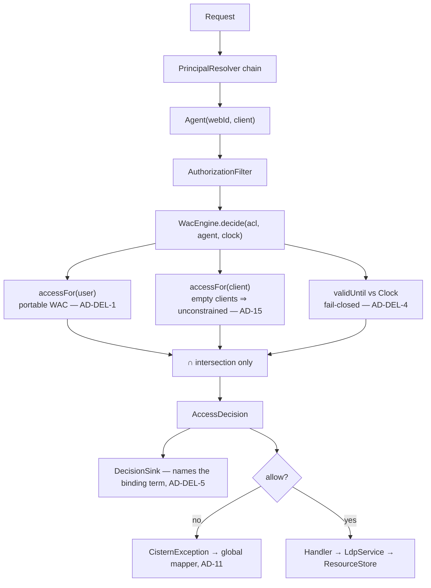

# Architecture Spine — Cistern agent-scoped delegation

## Design Paradigm

Inherited unchanged: **ports and adapters, with a Spring-free domain core**. This epic adds
no module and no port. It thickens one existing component — `WacEngine`, the policy engine —
and the value types it reads.

Where the work lands:

| Concern | Module | Namespace |
| --- | --- | --- |
| Vocabulary constants | `cistern-core` | `core.vocab` |
| Authorization value type, engine, grant authoring | `cistern-wac` | `wac` |
| Decision records and receipts | `cistern-wac` | `wac` |
| Grant CLI surface | `cistern-cli` | `cli` |

## Inherited Invariants

Binding and read-only. Not re-derived here; a local decision that contradicts one is a
conflict to surface, not an override.

| Inherited | From parent | Binds here |
| --- | --- | --- |
| AD-1 | `../ARCHITECTURE-SPINE.md` | `cistern-core` takes no framework dependency — the vocabulary class is plain Java |
| AD-2 | " | Dependency direction one-way; this epic adds no edge |
| AD-8 | " | Deny by default; `acl:Control` implies nothing |
| AD-9 | " | One enforcement point — every front door is an HTTP client, so a revoked or expired grant binds on the very next call |
| AD-11 | " | One error taxonomy, one mapper; a delegation refusal is a `CisternException` subtype, not an HTTP status chosen in `wac` |
| AD-12 | " | Fully reactive; no `.block()` in the evaluation path |
| **AD-14** | " | **Amended 2026-09-05 by owner ruling** — `WacEngine` may match on `Agent.client()` under AD-15 and AD-16. This spine governs the detail |
| **AD-15** | " | Intersection only, never union. **Absent a delegation naming the client, `accessFor(client)` is the unconstrained set, not the empty one.** Sub-delegation out; depth 1 |
| **AD-16** | " | Invisible to the harness or it does not ship: no policy present ⇒ plain WAC behaviour; narrowing-only ⇒ no passing assertion can begin failing; config-flagged and default off until the WAC suite is green (T5.5) |
| AD-17 | " | The conformance number only moves forward, and only the official lane moves it |

## Invariants & Rules

### AD-DEL-1 — Primary authority is portable WAC; our terms only reduce

- **Binds:** `wac.Authorization`, `wac.GrantService`, `cistern grant`, any future authoring surface
- **Prevents:** a narrowing constraint that fails **open** on export. AD-16 secures
  invisibility to the harness; it does not secure portability. If the only thing standing
  between an agent and the owner's full authority is a predicate another server ignores,
  then moving the pod to that server silently promotes the agent — the exact escalation this
  feature exists to prevent.
- **Rule:** every authorization's distinguishing term is portable WAC — `acl:agent` naming an
  agent's own WebID, or `acl:agentClass`. `cistern:client` and `cistern:validUntil` may only
  reduce what that portable term already allows. **An authorization whose sole distinguishing
  term is a Cistern extension is refused at authoring time**, not merely discouraged. Strip
  every Cistern term and what remains must already be a grant the owner would accept as
  permanent.

### AD-DEL-2 — The client is a constraint on an authorization, never a grantee

- **Binds:** `wac.Authorization`, `wac.Grantee`, `wac.GrantRequest`, `wac.WacEngine`
- **Prevents:** the divergence two builders would reach independently — one adding a
  `Grantee.Client` variant, one adding a field. The variant is the dangerous choice: it makes
  a client match another way to be *allowed in*, which is precisely the widening AD-15
  forbids and the accident AD-14 was written to stop.
- **Rule:** `Grantee` stays sealed at `WebId | Public`. `Authorization` gains
  `Set<URI> clients` and `Optional<Instant> validUntil`. **An empty `clients` set means
  unconstrained, never denied** — AD-15's identity element, without which every
  service-principal request denies. `GrantRequest` gains the matching optional inputs.

### AD-DEL-3 — One vocabulary class, profiled on ACP, and never `acl:origin`

- **Binds:** `core.vocab`, `wac.WacEngine#parse`, `wac.GrantService`, `cistern-cli`
- **Prevents:** three separate drifts — an inline IRI string; an ACP term embedded in a WAC
  document, which is neither ACP nor WAC and buys the appearance of alignment with none of
  the interop; and `acl:origin` stretched to mean an OAuth `client_id`, colliding with
  servers that implement it for browser trust.
- **Rule:** the terms are `cistern:client` and `cistern:validUntil`, declared as constants in
  `core.vocab.Cistern` alongside `Ldp`, `Solid`, `Acl`, `Foaf` and `Pim`. `cistern:client`
  is documented as the ACP `acp:client` matcher restricted to depth 1, so a later
  `cistern-acp` adopts the semantics rather than renegotiating them. `acl:origin` is not used
  for this purpose.

### AD-DEL-4 — Decision-time evaluation, fail-closed, against an injected `Clock`

- **Binds:** `wac.WacEngine#decide`, `wac.WacMessage`, `cistern-cli`, `docs/`
- **Prevents:** an expiry evaluated when the grant was written rather than when the request
  arrives; a malformed date defaulting to "still valid"; and — the one that matters for
  honesty — expiry being presented as a revocation mechanism when it is not.
- **Rule:** both dimensions evaluate inside `WacEngine.decide` against an injected `Clock`,
  never `Instant.now()` at the call site. A `validUntil` that is present and unparseable, or
  present and past, makes that authorization contribute **nothing** — fail closed — and the
  reason is a named `WacMessage` constant, never an inline string. **Expiry is a ceiling, not
  a revocation:** revoking means deleting the authorization, and no CLI text, error message or
  document may describe expiry as the way to revoke. Stripped on export a `validUntil`
  becomes permanent; AD-DEL-1 is what keeps that bounded in scope.

### AD-DEL-5 — The receipt names the term that bound

- **Binds:** `wac.DecisionRecord`, `wac.DecisionField`, `wac.DecisionSink`, `wac.AccessDecision`
- **Prevents:** a receipt that cannot distinguish *"the user never had this access"* from
  *"the delegation capped it"* — which is the audit value the whole feature exists to
  produce, and the difference the ValueDocs acceptance (#106, point 6) has to show.
- **Rule:** when `clients` or `validUntil` narrows a decision, the `DecisionRecord` names
  which term bound, as an enum-valued field rather than free text. A decision unaffected by
  either dimension records neither, so AD-16(1) holds — with no delegation present the record
  is byte-identical to today's.

### AD-DEL-6 — The seams both stories touch, fixed before either lands

- **Binds:** `wac.WacEngine`, `wac.Authorization`, `wac.DecisionField`, `wac.CisternWacProperties`
- **Prevents:** the divergence found by building T5.8 and T6.5 independently against every AD
  above — each obeys the letter of all of them and they still collide, because both stories
  edit the same four types and the ADs above do not say *how*.
- **Rule:** five seams, settled here:
  1. **`Clock` is a constructor collaborator of `WacEngine`, not a `decide` parameter.** It is
     a dependency, not per-call data, and both existing `decide` overloads keep their present
     signatures.
  2. **One narrowing path.** `decide(EffectiveAcl, Agent)` and
     `decide(Model, URI, Agent, AclScope)` both funnel into the single private method that
     applies the intersection and the expiry. Neither overload implements narrowing itself.
  3. **One `DecisionField`, enum-valued.** A single field names the narrowing term, taking an
     enum value — not one boolean field per dimension. A third dimension later adds an enum
     constant, never a fifth column.
  4. **Absence idioms are typed, not wrapped.** `Set<URI> clients` — empty means unconstrained;
     never `Optional<Set<URI>>`. `Optional<Instant> validUntil` — absent means no ceiling.
  5. **One flag gates both dimensions.** `cistern.wac.delegation.enabled` covers expiry *and*
     client scoping; for AD-16(3)'s purpose they are one feature, and a per-dimension flag
     would let half the extension reach the harness.

### Decision flow

## Consistency Conventions

Inherited in full from the parent spine. Added by this epic:

| Concern | Convention |
| --- | --- |
| Delegation vocabulary | `core.vocab.Cistern` — one constants class, joining `Ldp`, `Solid`, `Acl`, `Foaf`, `Pim`. Never an inline IRI |
| Narrowing reasons | A `WacMessage` catalogue constant per reason (`CLIENT_NOT_PERMITTED`, `GRANT_EXPIRED`, `GRANT_VALID_UNTIL_UNPARSEABLE`) — never an inline string |
| Decision fields | `DecisionField` enum extended; the binding term is enum-valued, never free text |
| Time | An injected `Clock`; `Instant.now()` never appears in `cistern-wac` |
| Config | `cistern.wac.delegation.enabled`, default `false` (AD-16(3)), with a binding test (AD-18) |

## Stack

Inherited unchanged. **This epic adds no runtime dependency** — `Instant` and `Clock` are
JDK, the vocabulary is a constants class, and the flag is an existing
`@ConfigurationProperties` surface.

## Capability → Architecture Map

| Story | Lives in | Governed by |
| --- | --- | --- |
| T5.8 / #92 — time-boxed grants | `wac.Authorization`, `wac.WacEngine`, `wac.GrantService`, `cistern-cli` | AD-DEL-1, AD-DEL-3, AD-DEL-4, AD-DEL-5, AD-16 |
| T6.5 / #119 — `(user, client)` principal | `wac.Authorization`, `wac.WacEngine`, `wac.GrantService`, `cistern-cli` | AD-DEL-1, AD-DEL-2, AD-DEL-3, AD-DEL-5, AD-14, AD-15, AD-16 |

The two stories are **independent**: expiry never reads `Agent.client()`, so T5.8 is
buildable with no dependency on the AD-14 amendment. They share `Authorization`,
`WacEngine.decide`, `GrantService` and the CLI, which is why one spine governs both — not
because one waits on the other.

## Deferred

- **`cistern-acp` and ACP proper** — the matcher algebra and `acp:AccessControlResource`.
  Still a phase in its own right. This epic removes client scoping as its reason to exist;
  it does not schedule what remains.
- **Sub-delegation.** Depth 1, per AD-15. If chains are ever wanted, adopt macaroons or
  Biscuit rather than invent a third attenuation scheme.
- **The owner-facing authoring surface.** A Turtle file is an answer for us and not for a pod
  owner. Out of v1 on purpose, and the part that historically kills systems of this shape.
- **Purpose limitation, call-count budgets, and predicate- or triple-level scoping.** Each
  multiplies the enforcement surface and the consent problem together.
- **Advertising the extension in the storage description.** Whether a pod should announce
  that its ACLs carry terms another server will not honour is a real question and an
  AD-DEL-1 mitigation, not a replacement for it. Revisit once a second implementation exists
  to advertise to.
